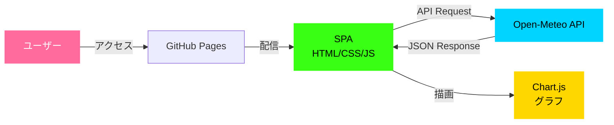
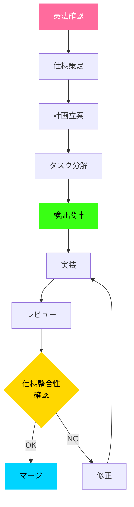
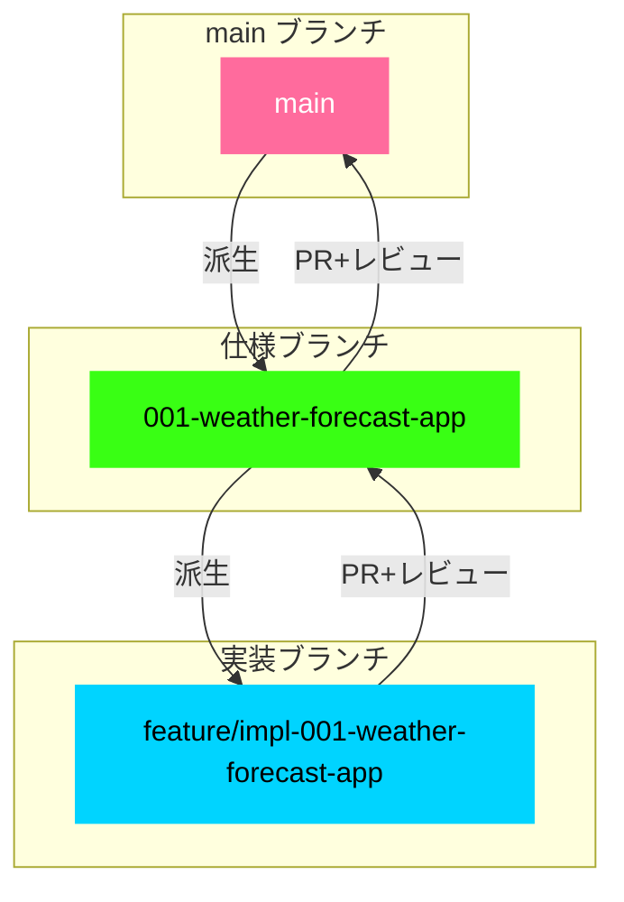

# プロジェクト憲法: Open-Meteo 気温予測アプリケーション

## メタデータ

| 項目                     | 値                                     |
| ------------------------ | -------------------------------------- |
| **プロジェクト名** | Open-Meteo 気温予測アプリケーション    |
| **リポジトリ**     | https://github.com/J1921604/open-meteo |
| **バージョン**     | 1.0.0                                  |
| **批准日**         | 2025-12-15                             |
| **ステータス**     | 有効                                   |

---

## 1. プロジェクト目的

本プロジェクトは、Open-Meteo API を使用したサイバーパンク風気温予測Webアプリケーションの開発・保守を目的とする。世界の主要都市の気温を過去から未来まで可視化し、ユーザーに直感的でインタラクティブな気象データ閲覧体験を提供する。

### システムアーキテクチャ



---

## 2. 基本原則

### 原則1: テスト駆動開発の徹底

**原則声明**: すべての機能は、実装前にテストコードを作成し、仕様に対する検証を必須とする。

**詳細ルール**:

- テスト作成 → ユーザー承認 → テスト失敗確認 → 実装 → テスト成功確認の順序を厳守すること
- ユニットテストはすべての公開関数・メソッドに対して作成すること
- 統合テストは主要なユーザーシナリオ（User Story）ごとに作成すること
- E2Eテストはアプリケーション全体の動作検証に使用すること
- テストカバレッジは最低80%を維持すること（コード行ベース）
- すべてのプルリクエストはテスト成功を必須条件とすること

**遵守すべき理由**:
テスト駆動開発により、仕様と実装の乖離を早期発見し、リグレッションを防止する。仕様変更時の影響範囲を明確化し、安全なリファクタリングを実現する。

---

### 原則2: セキュリティ優先設計

**原則声明**: セキュリティ要件は機能要件より優先し、機密データの保護を最優先する。

**詳細ルール**:

- 機密データ（APIキー、個人情報、認証トークン等）の平文保存を禁止すること
- 機密データは暗号化またはハッシュ化して保存すること（AES-256以上またはbcrypt/Argon2等）
- 外部APIとの通信はHTTPS（TLS 1.2以上）を使用すること
- ユーザー入力は必ずバリデーションとサニタイゼーションを実施すること
- 依存ライブラリの既知の脆弱性を定期的にスキャンすること（npm audit等）
- セキュリティレビューはすべての主要リリース前に実施すること

**遵守すべき理由**:
セキュリティ侵害は、ユーザーの信頼喪失、データ漏洩、法的責任につながる。機能追加よりもセキュリティ対策を優先することで、長期的なプロジェクトの信頼性を確保する。

---

### 原則3: パフォーマンス定量化と検証

**原則声明**: パフォーマンス閾値を定量化し、受入基準に組み込むこと。

**詳細ルール**:

- **APIレスポンスタイム**: 95パーセンタイルで200ms以下を維持すること
- **初回ページロード**: 3G環境で3秒以内に表示完了すること
- **グラフ描画パフォーマンス**: 100データポイントで100ms以下を維持すること
- **メモリ使用量**: ブラウザ環境で100MB以下を維持すること
- すべてのパフォーマンス要件は自動テストで検証すること
- パフォーマンス劣化を検知した場合、原因調査と修正を優先すること
- リリース前にパフォーマンステストを必須とすること

**遵守すべき理由**:
定量化されたパフォーマンス基準により、ユーザー体験の一貫性を保証する。パフォーマンス劣化の早期発見と修正により、リリース後の問題を未然に防ぐ。

---

### 原則4: コード品質基準の維持

**原則声明**: 一貫したコード品質を維持し、可読性・保守性を最優先する。

**詳細ルール**:

- ESLint / Prettier 等のコード整形ツールを使用し、コードスタイルを統一すること
- 関数は単一責任原則に従い、1つの機能のみを実装すること
- 複雑な処理は適切にコメントを付与すること
- マジックナンバーを避け、定数として定義すること
- グローバル変数の使用を最小限に抑えること
- すべてのコミットメッセージは `.github/copilot-commit-message-instructions.md` に従うこと
- コードレビューはすべてのプルリクエストで必須とすること

**遵守すべき理由**:
一貫したコード品質により、チーム全体の開発効率が向上し、バグの混入を防ぐ。保守性の高いコードは、長期的なプロジェクト継続を可能にする。

---

### 原則5: ユーザー体験の一貫性

**原則声明**: すべての機能でユーザー体験の一貫性を保ち、直感的な操作を提供する。

**詳細ルール**:

- UIデザインはプロジェクトのデザインシステム（サイバーパンク風テーマ）に従うこと
- エラーメッセージは具体的で実行可能なアドバイスを含むこと
- ローディング状態は明確に表示すること（スピナー、プログレスバー等）
- レスポンシブデザインを徹底し、すべてのデバイスで動作すること
- アクセシビリティ基準（WCAG 2.1 レベルA以上）を遵守すること
- ユーザーフィードバック（クリック、ホバー等）は即座に反応すること

**遵守すべき理由**:
一貫したユーザー体験により、ユーザーの学習コストを削減し、満足度を向上させる。アクセシビリティ対応により、より多くのユーザーにサービスを提供できる。

---

## 3. 制約事項

### 制約1: 機密データの保護

**制約内容**: 機密データの平文保存を禁止する。暗号化またはハッシュ化を必須とする。

**適用範囲**: すべてのデータ保存処理（ローカルストレージ、Cookie、データベース等）

**例外**: なし

---

### 制約2: 外部依存のバージョン固定

**制約内容**: すべての外部依存ライブラリはバージョンを固定し、再現性を確保する。

**適用範囲**: `package.json` のすべての依存関係（dependencies、devDependencies）

**ルール**:

- セマンティックバージョニング範囲指定（`^`, `~`）を使用しないこと
- 正確なバージョン番号（例: `4.4.0`）を指定すること
- バージョン更新は明示的なレビューとテスト後に実施すること

**例外**: なし

---

### 制約3: 仕様と実装の整合性維持

**制約内容**: 仕様ドキュメントと実装の乖離をレビューで検知・是正する。

**適用範囲**: すべての機能開発・変更

**ルール**:

- 実装前に仕様ドキュメント（spec.md）を作成・承認すること
- 実装後、仕様と実装の整合性を確認すること
- 仕様変更時は、影響範囲を明確化し、関連ドキュメントをすべて更新すること

**例外**: 緊急バグ修正時は事後ドキュメント更新を許可する

---

## 4. ガバナンス

### 作業順序

すべての開発作業は以下の順序で実施すること:



1. **憲法確認**: プロジェクト憲法（本ドキュメント）の原則を確認
2. **仕様策定**: 機能仕様（spec.md）を作成・承認
3. **計画立案**: 実装計画（plan.md）を作成
4. **タスク分解**: タスクリスト（tasks.md）を作成
5. **検証設計**: テストコードを作成
6. **実装**: 機能を実装
7. **レビュー**: コードレビューと仕様整合性確認

### ブランチ戦略



**仕様ブランチ**: mainブランチから派生

```bash
git checkout main
git checkout -b <番号>-<短い名前>
# 例: git checkout -b 001-weather-forecast-app
```

**実装ブランチ**: 仕様ブランチから派生

```bash
git checkout <番号>-<topic>
git checkout -b feature/impl-<番号>-<短い名前>
# 例: git checkout 001-weather-forecast-app
# git checkout -b feature/impl-001-weather-forecast-app
```

**マージ戦略**:

- 実装ブランチ → 仕様ブランチ: プルリクエスト + レビュー必須
- 仕様ブランチ → mainブランチ: プルリクエスト + レビュー必須

### レビュー承認

以下の変更には、レビュー承認を必須とする:

- 新機能追加
- 既存機能の変更（破壊的変更）
- セキュリティ関連の変更
- パフォーマンス影響のある変更
- 憲法ドキュメントの改訂

### 憲法改訂プロセス

本憲法の改訂は以下の手順で実施する:

1. **改訂提案**: 改訂理由と変更内容を明確化
2. **影響分析**: 既存の仕様・実装への影響を分析
3. **レビュー**: チーム全体でレビュー・承認
4. **バージョン更新**: セマンティックバージョニングに従いバージョンを更新
   - MAJOR: 後方互換性のない原則の削除・再定義
   - MINOR: 新しい原則・セクションの追加
   - PATCH: 明確化、文言修正、誤字修正
5. **関連ドキュメント更新**: テンプレート、仕様、計画を更新
6. **コミット**: 変更をコミット・プッシュ

### バージョニングポリシー

- 憲法バージョンは `MAJOR.MINOR.PATCH` 形式とする
- すべての改訂は変更履歴（Sync Impact Report）に記録する
- 改訂日は ISO 8601 形式（YYYY-MM-DD）で記録する

### コンプライアンスレビュー

- すべてのプルリクエストは憲法原則への準拠を確認すること
- 四半期ごとに憲法遵守状況をレビューすること
- 違反発見時は、原因分析と再発防止策を講じること

---

## 5. 開発方針

### フロントエンド・バックエンド統合

- フロントエンドとバックエンドを同時に起動するスクリプトを提供すること
- 開発環境のセットアップは `README.md` に明記すること

### 継続的検証

- 正常に動作するまで繰り返し検証し、エラー修正を完了すること
- すべてのテストが成功するまでリリースしないこと

### ドキュメント品質

- フローチャート等の図はMermaid記法（v11準拠）を使用すること
- すべてのドキュメントはUTF-8エンコーディングを使用すること
- 英語のテンプレート記述は日本語に置き換えること

### Mermaid v11 対応ベストプラクティス

1. **gitGraph使用時の注意**:

   - 日本語を避けるか、flowchart/graph形式を使用
   - `tag:` 構文は非推奨、代わりにノードで表現
2. **日本語対応**:

   - flowchart、graph、sequenceDiagramは日本語完全対応
   - ノードラベル、エッジラベル、Noteで日本語使用可能
3. **推奨構文**:

   - ブランチ戦略: `flowchart TB` + `subgraph`
   - プロセスフロー: `flowchart TD/LR`
   - 時系列: `sequenceDiagram`
   - 状態遷移: `stateDiagram-v2`

### ローカル実装・検証

- GithubPageデプロイ前にローカルでビルドとプレビューを検証すること
- テスト100%正常に機能が動作するまで繰り返し修正すること
- Python 3.10.11を標準実行環境とする
- Pythonコマンドは `py -3.10` を使用すること

---

## 6. 適用範囲

本憲法は以下に適用される:

- すべての機能開発・変更
- すべてのコードレビュー
- すべてのリリース判定
- すべてのドキュメント作成・更新

---

## 7. 有効期限

本憲法は改訂または廃止されるまで有効とする。

---

**署名**: GitHub Copilot
**批准日**: 2025-12-15
