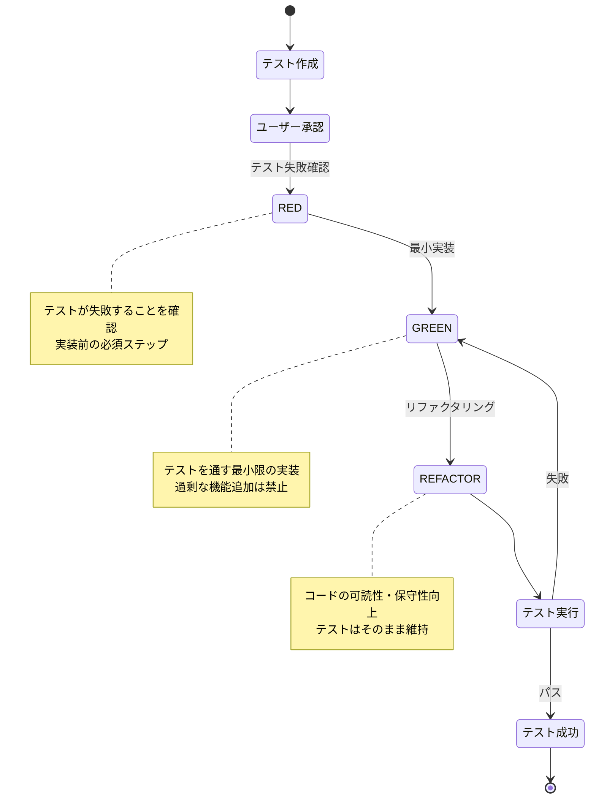
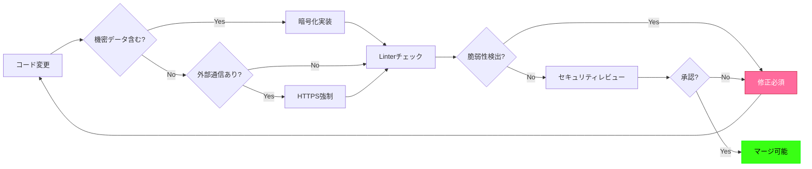
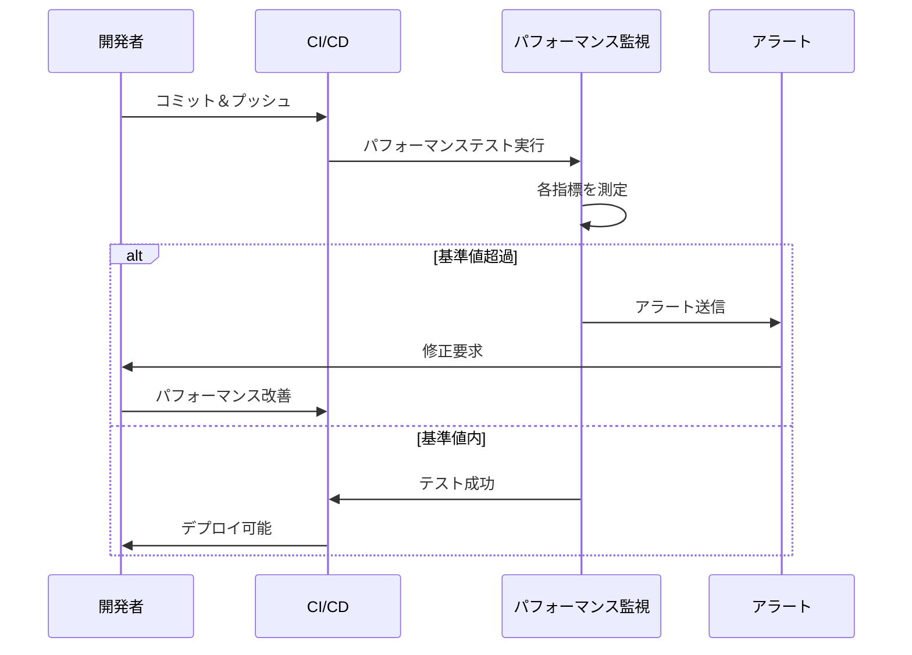
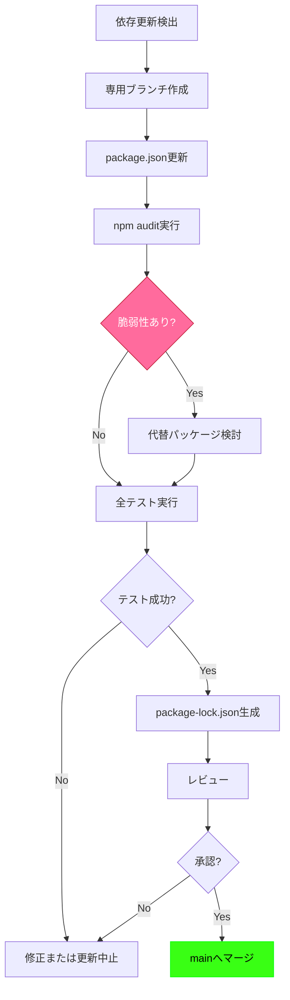
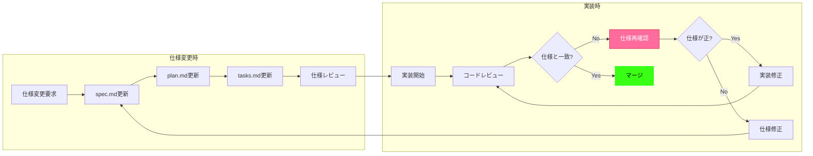
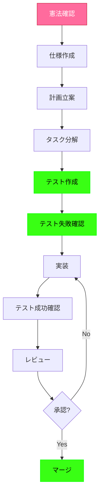
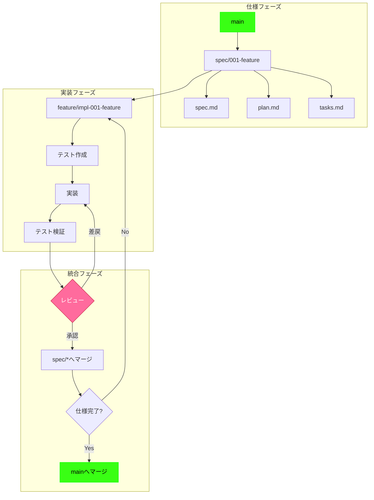

<!--
同期影響レポート (Sync Impact Report)
=====================================
バージョン変更: 初版 → 1.0.0
変更された原則: なし（新規作成）
追加されたセクション:
  - コア原則 (5つ)
    I. テスト駆動開発の徹底（絶対遵守）
    II. セキュリティ最優先
    III. パフォーマンス定量化
    IV. 外部依存の再現性確保
    V. 仕様・実装乖離の検知と是正
  - セキュリティ・品質制約
    - セキュリティ制約（STRIDE脅威モデル）
    - 品質制約（コード品質メトリクス、デザインシステム定義）
  - 開発ワークフロー
    - 作業順序フロー図（Mermaid）
    - ブランチ戦略フロー図（Mermaid）
    - マージ基準（仕様・実装）
    - レビュープロセス
  - ガバナンス
    - 憲法の位置付け
    - 憲法改正プロセス（提案テンプレート、改正履歴）
    - 遵守検証（PRチェックリスト、四半期監査）
    - バージョニングルール

追加された図表:
  - TDDサイクル（stateDiagram-v2）
  - セキュリティチェックフロー（flowchart）
  - パフォーマンス監視シーケンス（sequenceDiagram）
  - 依存更新フロー（flowchart）
  - 仕様・実装同期フロー（flowchart）
  - ブランチ戦略フロー（flowchart）
  - 作業順序フロー（flowchart）

テンプレート更新状況:
  ✅ plan-template.md - Constitution Check セクション更新（具体的チェック項目追加）
  ✅ spec-template.md - User Scenarios & Testing、Requirements セクションが対応済み
  ✅ tasks-template.md - テスト駆動開発、優先順位付けが対応済み
  ✅ copilot-instructions.md - 憲法参照リンク、5つの原則概要追加
  ✅ README.md - 新規作成（プロジェクト概要、憲法参照）

フォローアップアクション:
  - 実装ブランチからの最初のPR時に憲法遵守チェックリストを使用
  - パフォーマンス閾値の自動テストをCIパイプラインに組み込み
  - 四半期監査（2025-Q1: 2025-03-31）を実施
  - デザインシステムCSS変数を style.css に適用
  - ESLint設定ファイルに複雑度制限（complexity: 15）を追加
  - セキュリティスキャン（npm audit）の自動化
  
バージョン情報:
  初版リリース: 2025-11-21
  現行バージョン: 1.0.0
  最終更新: 2025-11-25（グラフ凡例文字色修正、実績・予測グラフ連続化）
  次回レビュー予定: 2025-12-21（1ヶ月後）
-->

# Open-Meteo 気温予測アプリケーション憲法

## コア原則

### I. テスト駆動開発の徹底（絶対遵守）

すべての機能実装はテスト駆動開発（TDD）で進める。実装前にテストを作成し、仕様に対する検証を必須とする。

**必須要件:**

- テスト作成 → ユーザー承認 → テスト失敗確認 → 実装開始の順序を厳守
- Red-Green-Refactor サイクルの遵守
- 受入基準（Acceptance Criteria）は Given-When-Then 形式で記述
- 実装コード量に対するテストカバレッジ率80%以上を維持

**根拠:**
仕様と実装の乖離を最小化し、回帰バグを防止する。テストが仕様書として機能し、長期的なメンテナンス性を確保する。

**TDDサイクル:**


```mermaid
stateDiagram-v2
    [*] --> テスト作成
    テスト作成 --> ユーザー承認
    ユーザー承認 --> RED: テスト失敗確認
    RED --> GREEN: 最小実装
    GREEN --> REFACTOR: リファクタリング
    REFACTOR --> テスト実行
    テスト実行 --> テスト成功: パス
    テスト実行 --> GREEN: 失敗
    テスト成功 --> [*]
  
    note right of RED
        テストが失敗することを確認
        実装前の必須ステップ
    end note
  
    note right of GREEN
        テストを通す最小限の実装
        過剰な機能追加は禁止
    end note
  
    note right of REFACTOR
        コードの可読性・保守性向上
        テストはそのまま維持
    end note
```

### II. セキュリティ最優先

セキュリティ要件は機能要件より常に優先される。セキュリティ違反のコードは品質ゲートを通過できない。

**必須要件:**

- 機密データ（APIキー、個人情報、認証トークン等）の平文保存を禁止
- 暗号化・ハッシュ化の実装が必須
- 外部APIとの通信は HTTPS を強制
- XSS、CSRF、インジェクション攻撃への対策を実装前に設計
- セキュリティレビューを全PRで実施

**根拠:**
ユーザーデータ保護とアプリケーション信頼性の確保。セキュリティ問題は後から修正するより、設計段階で防ぐ方がコストが低い。

**セキュリティチェックフロー:**


```mermaid
flowchart LR
    A[コード変更] --> B{機密データ含む?}
    B -->|Yes| C[暗号化実装]
    B -->|No| D{外部通信あり?}
    C --> E[Linterチェック]
    D -->|Yes| F[HTTPS強制]
    D -->|No| E
    F --> E
    E --> G{脆弱性検出?}
    G -->|Yes| H[修正必須]
    G -->|No| I[セキュリティレビュー]
    H --> A
    I --> J{承認?}
    J -->|Yes| K[マージ可能]
    J -->|No| H
  
    style H fill:#ff6b9d,stroke:#c41e3a,color:#fff
    style K fill:#39ff14,stroke:#0f0,color:#000
```

### III. パフォーマンス定量化

パフォーマンス要件を定量的に定義し、受入基準に組み込む。測定不可能な要件は受け入れない。

**必須要件:**

- API レスポンスタイム: 95パーセンタイルで 200ms 以下
- 初回ページロード時間: 3秒以内（3G接続環境）
- グラフ描画処理: 100データポイントで 100ms 以下
- メモリ使用量: ブラウザで 100MB 以下
- パフォーマンステストを継続的インテグレーション（CI）に含める

**根拠:**
ユーザー体験の一貫性を保証。パフォーマンス劣化を早期検知し、リリース前に是正する。

**パフォーマンス監視マトリックス:**

| 指標          | 目標値           | 測定方法                 | 失敗時対応                     |
| ------------- | ---------------- | ------------------------ | ------------------------------ |
| APIレスポンス | 200ms以下（P95） | Performance API          | API最適化、キャッシュ導入      |
| 初回ロード    | 3秒以内（3G）    | Lighthouse               | バンドルサイズ削減、遅延ロード |
| グラフ描画    | 100ms以下        | performance.mark/measure | データ間引き、Canvas最適化     |
| メモリ使用量  | 100MB以下        | Chrome DevTools          | メモリリーク修正、GC最適化     |

**継続的監視フロー:**


```mermaid
sequenceDiagram
    participant Dev as 開発者
    participant CI as CI/CD
    participant Monitor as パフォーマンス監視
    participant Alert as アラート
  
    Dev->>CI: コミット＆プッシュ
    CI->>Monitor: パフォーマンステスト実行
    Monitor->>Monitor: 各指標を測定
  
    alt 基準値超過
        Monitor->>Alert: アラート送信
        Alert->>Dev: 修正要求
        Dev->>CI: パフォーマンス改善
    else 基準値内
        Monitor->>CI: テスト成功
        CI->>Dev: デプロイ可能
    end
```

### IV. 外部依存の再現性確保

外部依存パッケージはバージョンを固定し、環境の再現性を確保する。

**必須要件:**

- `package.json` / `package-lock.json` でバージョンを厳密に固定
- セマンティックバージョニング範囲指定（`^`, `~`）を避ける
- 依存パッケージの更新は専用ブランチで検証後にマージ
- 本番環境と開発環境のパッケージバージョン完全一致を保証

**根拠:**
「手元では動くが本番で動かない」問題を根絶。チーム全体で同一環境を保証し、デバッグ効率を向上させる。

**依存パッケージ管理ベストプラクティス:**

```json
// ❌ 悪い例（範囲指定）
{
  "dependencies": {
    "chart.js": "^4.0.0",    // 4.x.x の最新が入る（不確定）
    "express": "~5.0.0"      // 5.0.x の最新が入る（不確定）
  }
}

// ✅ 良い例（固定バージョン）
{
  "dependencies": {
    "chart.js": "4.4.0",     // 常に 4.4.0（確定）
    "express": "5.0.1"       // 常に 5.0.1（確定）
  }
}
```

**依存更新フロー:**


```mermaid
flowchart TD
    A[依存更新検出] --> B[専用ブランチ作成]
    B --> C[package.json更新]
    C --> D[npm audit実行]
    D --> E{脆弱性あり?}
    E -->|Yes| F[代替パッケージ検討]
    E -->|No| G[全テスト実行]
    F --> G
    G --> H{テスト成功?}
    H -->|No| I[修正または更新中止]
    H -->|Yes| J[package-lock.json生成]
    J --> K[レビュー]
    K --> L{承認?}
    L -->|Yes| M[mainへマージ]
    L -->|No| I
  
    style E fill:#ff6b9d,stroke:#c41e3a,color:#fff
    style M fill:#39ff14,stroke:#0f0,color:#000
```

### V. 仕様・実装乖離の検知と是正

仕様ドキュメントと実装コードの乖離をレビューで検知し、即座に是正する。

**必須要件:**

- 仕様変更は必ず `specs/` ディレクトリのドキュメントに反映
- コードレビュー時に仕様ドキュメントとの整合性を確認
- 実装が仕様を超えた機能追加を禁止（スコープクリープ防止）
- 仕様変更履歴を Git コミットログと紐付け

**根拠:**
ドキュメントと実装の不一致は将来の保守コストを指数関数的に増加させる。常に同期を維持することで技術的負債を抑制する。

**仕様・実装同期フロー:**


```mermaid
flowchart LR
    subgraph "仕様変更時"
        A[仕様変更要求] --> B[spec.md更新]
        B --> C[plan.md更新]
        C --> D[tasks.md更新]
        D --> E[仕様レビュー]
    end
  
    subgraph "実装時"
        E --> F[実装開始]
        F --> G[コードレビュー]
        G --> H{仕様と一致?}
        H -->|No| I[仕様再確認]
        I --> J{仕様が正?}
        J -->|Yes| K[実装修正]
        J -->|No| L[仕様修正]
        L --> B
        K --> G
        H -->|Yes| M[マージ]
    end
  
    style I fill:#ff6b9d,stroke:#c41e3a,color:#fff
    style M fill:#39ff14,stroke:#0f0,color:#000
```

**レビューチェックリスト（実装ブランチ）:**

- [ ] 実装が仕様ドキュメント（spec.md）の要件を満たしている
- [ ] 仕様に記載されていない機能を追加していない
- [ ] テストケースが受入基準（Acceptance Criteria）をカバーしている
- [ ] APIレスポンス形式が契約（contracts/）と一致している
- [ ] パフォーマンス目標を達成している
- [ ] セキュリティ要件を満たしている

## セキュリティ・品質制約

### セキュリティ制約

1. **機密データ保護:**

   - API キーは環境変数または暗号化ストレージに保存
   - コードベースに機密情報を含めない（.gitignore で除外）
   - ログ出力に機密情報を含めない
2. **依存パッケージ監査:**

   - `npm audit` を CI パイプラインで実行
   - 高リスク脆弱性が検出された場合はビルド失敗
   - 月次で依存パッケージセキュリティレビューを実施
3. **入力検証:**

   - ユーザー入力は必ずバリデーション
   - HTML エスケープ処理を施す
   - API レスポンスの型チェックを実装

**セキュリティ脅威モデル（STRIDE）:**

| 脅威                                         | 対策                             | 実装場所        |
| -------------------------------------------- | -------------------------------- | --------------- |
| **S**poofing（なりすまし）             | HTTPS通信、CORS設定              | API通信レイヤー |
| **T**ampering（改ざん）                | 入力検証、CSP設定                | フロントエンド  |
| **R**epudiation（否認）                | アクセスログ記録                 | サーバーサイド  |
| **I**nformation Disclosure（情報漏洩） | 機密データ暗号化、ログマスキング | 全レイヤー      |
| **D**enial of Service（DoS）           | レート制限、タイムアウト設定     | API通信レイヤー |
| **E**levation of Privilege（権限昇格） | 最小権限原則、認可チェック       | 認証レイヤー    |

**セキュリティチェックリスト（全PR必須）:**

- [ ] 機密情報がコードに含まれていない
- [ ] ユーザー入力に対するバリデーション実装済み
- [ ] XSS対策（HTMLエスケープ）実装済み
- [ ] HTTPS通信を強制している
- [ ] `npm audit` で高リスク脆弱性なし
- [ ] ログに機密情報が含まれていない
- [ ] Content Security Policy (CSP) 設定済み（該当する場合）

### 品質制約

1. **コード品質基準:**

   - Linter（ESLint 等）エラーゼロを維持
   - コードフォーマッター（Prettier 等）で統一
   - 複雑度（Cyclomatic Complexity）15 以下
   - 関数は単一責任原則に従う（50行以内推奨）
2. **ドキュメント品質:**

   - 全ての公開関数に JSDoc コメント
   - README に環境構築手順を記載
   - Mermaid 図（v11準拠）でフロー・アーキテクチャを可視化
3. **ユーザー体験一貫性:**

   - デザインシステム（色、フォント、スペーシング）を定義
   - アクセシビリティ（ARIA ラベル、キーボード操作）を考慮
   - レスポンシブデザイン（モバイル・タブレット・デスクトップ）

**コード品質メトリクス:**

| メトリクス       | 基準値          | 測定ツール          | 違反時対応           |
| ---------------- | --------------- | ------------------- | -------------------- |
| Lintエラー       | 0               | ESLint              | マージブロック       |
| 複雑度           | ≤15            | ESLint (complexity) | リファクタリング必須 |
| テストカバレッジ | ≥80%           | Jest                | 追加テスト作成       |
| 関数行数         | ≤50行          | 手動レビュー        | 関数分割             |
| ドキュメント率   | 100%（公開API） | JSDoc検証           | コメント追加         |

**デザインシステム定義（サイバーパンク風）:**

```css
/* カラーパレット */
:root {
  /* プライマリカラー（緑ネオン） */
  --color-primary: #39ff14;
  --color-primary-dark: #2dd10f;
  --color-primary-light: #5fff3d;
  
  /* アクセントカラー（マゼンタ） */
  --color-accent: #ff6b9d;
  --color-accent-dark: #e64980;
  --color-accent-light: #ff8fb3;
  
  /* 背景色（ダーク基調） */
  --color-bg-primary: #0a0e27;
  --color-bg-secondary: #1a1f3a;
  --color-bg-tertiary: #2a2f4a;
  
  /* テキストカラー */
  --color-text-primary: #e0e6f0;
  --color-text-secondary: #a0a6b0;
  
  /* 発光エフェクト */
  --glow-primary: 0 0 10px var(--color-primary);
  --glow-accent: 0 0 10px var(--color-accent);
}

/* タイポグラフィ */
:root {
  --font-family-primary: 'Courier New', monospace;
  --font-family-secondary: 'Arial', sans-serif;
  
  --font-size-xs: 12px;
  --font-size-sm: 14px;
  --font-size-md: 16px;
  --font-size-lg: 20px;
  --font-size-xl: 24px;
}

/* スペーシング */
:root {
  --spacing-xs: 4px;
  --spacing-sm: 8px;
  --spacing-md: 16px;
  --spacing-lg: 24px;
  --spacing-xl: 32px;
}
```

**アクセシビリティチェックリスト:**

- [ ] すべてのインタラクティブ要素にキーボードアクセス可能
- [ ] フォーム入力に適切な `<label>` 要素
- [ ] 画像に `alt` 属性
- [ ] ARIA ラベル（`aria-label`, `aria-labelledby`）を適切に使用
- [ ] カラーコントラスト比 4.5:1 以上（WCAG AA基準）
- [ ] フォーカス表示が明確（`:focus` スタイル）

## 開発ワークフロー

### 作業順序（厳守）


```mermaid
flowchart TD
    A[憲法確認] --> B[仕様作成]
    B --> C[計画立案]
    C --> D[タスク分解]
    D --> E[テスト作成]
    E --> F[テスト失敗確認]
    F --> G[実装]
    G --> H[テスト成功確認]
    H --> I[レビュー]
    I --> J{承認?}
    J -->|Yes| K[マージ]
    J -->|No| G
  
    style A fill:#ff6b9d,stroke:#c41e3a,color:#fff
    style E fill:#39ff14,stroke:#0f0,color:#000
    style F fill:#39ff14,stroke:#0f0,color:#000
    style K fill:#39ff14,stroke:#0f0,color:#000
```

### ブランチ戦略


```mermaid
flowchart TB
    subgraph "仕様フェーズ"
        A[main] --> B[spec/001-feature]
        B --> C[spec.md]
        B --> D[plan.md]
        B --> E[tasks.md]
    end
  
    subgraph "実装フェーズ"
        B --> F[feature/impl-001-feature]
        F --> G[テスト作成]
        G --> H[実装]
        H --> I[テスト検証]
    end
  
    subgraph "統合フェーズ"
        I --> J{レビュー}
        J -->|承認| K[spec/*へマージ]
        K --> L{仕様完了?}
        L -->|Yes| M[mainへマージ]
        L -->|No| F
        J -->|差戻| H
    end
  
    style A fill:#39ff14,stroke:#0f0,color:#000
    style M fill:#39ff14,stroke:#0f0,color:#000
    style J fill:#ff6b9d,stroke:#c41e3a,color:#fff
```

#### 仕様ブランチ（main ブランチから派生）

仕様変更・新機能仕様は専用ブランチで作成する。

```bash
git checkout main
git checkout -b spec/<番号>-<短い名前>
# 例: spec/001-temperature-chart
```

**対象ファイル:**

- `.specify/specs/<番号>-<機能名>/spec.md` - ユーザーストーリー、要件定義
- `.specify/specs/<番号>-<機能名>/plan.md` - 実装計画、技術スタック
- `.specify/specs/<番号>-<機能名>/tasks.md` - タスク分解、依存関係
- `.specify/specs/<番号>-<機能名>/research.md` - 技術調査結果（必要時）
- `.specify/specs/<番号>-<機能名>/data-model.md` - データモデル定義（必要時）
- `.specify/specs/<番号>-<機能名>/contracts/` - API契約定義（必要時）

#### 実装ブランチ（仕様ブランチから派生）

実装は仕様ブランチから分岐する。

```bash
git checkout spec/001-temperature-chart
git checkout -b feature/impl-001-temperature-chart
```

**対象ファイル:**

- `src/`, `tests/` 配下の実装ファイル
- `package.json`, `package-lock.json` の依存追加
- 実装に関連するドキュメント（必要時）

### マージ基準

#### 仕様ブランチのマージ（spec/* → main）

- [ ] 仕様ドキュメントが完成（spec.md, plan.md, tasks.md）
- [ ] レビュアーによる仕様承認
- [ ] 憲法原則との整合性確認

#### 実装ブランチのマージ（feature/impl-* → spec/*）

- [ ] 全テストがパス（ユニット・統合・契約テスト）
- [ ] テストカバレッジ 80% 以上
- [ ] Linter エラーゼロ
- [ ] パフォーマンステストが基準を満たす
- [ ] セキュリティレビュー完了
- [ ] 仕様ドキュメントとの整合性確認
- [ ] レビュアー承認（最低1名）

### レビュープロセス

1. **セルフレビュー:**

   - 憲法チェックリストを確認
   - テスト実行・カバレッジ確認
   - Linter 実行
2. **ピアレビュー:**

   - 仕様との整合性
   - セキュリティ脆弱性チェック
   - パフォーマンス影響評価
   - コード可読性・保守性
3. **承認基準:**

   - 重大変更（API 変更、データモデル変更）は2名以上の承認必須
   - 軽微な変更（ドキュメント修正、タイポ修正）は1名承認で可

### 同時開発の調整

フロントエンドとバックエンドを同時開発する場合:

1. 契約（API 仕様）を先に定義
2. モックサーバーで並行開発
3. 統合テストで最終検証

## ガバナンス

### 憲法の位置付け

本憲法はすべての開発プラクティス、ツール選定、設計判断に優先する。

### 憲法改正プロセス

1. 改正提案をイシューで起票
2. 影響範囲分析（既存コード・ドキュメント）
3. チームレビューと承認
4. マイグレーション計画策定
5. バージョン更新（セマンティックバージョニング）
6. 関連テンプレート・ドキュメントの同期更新

**改正提案テンプレート:**

```markdown
## 憲法改正提案

**提案日**: YYYY-MM-DD  
**提案者**: [NAME]  
**対象原則**: [原則番号と名称]

### 現状の問題点
[現在の原則で解決できない問題を記述]

### 改正案
[新しい原則または変更内容]

### 影響範囲分析
- 既存コードへの影響: [影響あり/なし]
- テンプレートへの影響: [plan-template.md, spec-template.md 等]
- 進行中プロジェクトへの影響: [影響あり/なし]

### マイグレーション計画
[既存コードの移行方法]

### バージョン更新
- 現在: 1.0.0
- 提案: 1.1.0（MINOR: 新原則追加）

### レビュアー承認
- [ ] レビュアー1: [NAME]
- [ ] レビュアー2: [NAME]
```

**改正履歴例:**

| バージョン | 日付       | 変更内容         | 理由                                        |
| ---------- | ---------- | ---------------- | ------------------------------------------- |
| 1.0.0      | 2025-11-21 | 初版策定         | プロジェクト開始時の憲法制定                |
| 1.0.1      | -          | （今後の修正例） | 誤字修正                                    |
| 1.1.0      | -          | （今後の追加例） | 新原則「VI. 監視可能性」追加                |
| 2.0.0      | -          | （今後の変更例） | 原則III「パフォーマンス定量化」の大幅見直し |

### 遵守検証

- すべてのプルリクエストで憲法遵守を確認
- レビューチェックリストに憲法項目を含める
- 四半期ごとに憲法適合性監査を実施

**プルリクエストチェックリスト（必須）:**

```markdown
## 憲法遵守確認

### I. テスト駆動開発
- [ ] テストを実装前に作成した
- [ ] テストが失敗することを確認した
- [ ] 最小限の実装でテストを通した
- [ ] テストカバレッジ80%以上

### II. セキュリティ最優先
- [ ] 機密データの平文保存なし
- [ ] HTTPS通信を使用
- [ ] XSS/CSRF対策実装済み
- [ ] `npm audit` でクリティカル脆弱性なし

### III. パフォーマンス定量化
- [ ] APIレスポンスタイム200ms以下
- [ ] 初回ページロード3秒以内
- [ ] グラフ描画100ms以下
- [ ] メモリ使用量100MB以下

### IV. 外部依存の再現性確保
- [ ] `package.json` でバージョン固定
- [ ] `package-lock.json` を更新
- [ ] セマンティックバージョニング範囲指定なし

### V. 仕様・実装乖離の検知と是正
- [ ] 仕様ドキュメントと実装が一致
- [ ] スコープクリープなし
- [ ] 仕様変更をドキュメント反映

### レビュアー承認
- [ ] レビュアー: [NAME] - 承認日: [YYYY-MM-DD]
```

**四半期憲法監査項目:**

| 監査項目             | 確認内容                      | 合格基準        |
| -------------------- | ----------------------------- | --------------- |
| テストカバレッジ     | 全モジュールのカバレッジ率    | 平均80%以上     |
| セキュリティスキャン | 依存パッケージの脆弱性        | クリティカル0件 |
| パフォーマンス回帰   | 過去3ヶ月のパフォーマンス推移 | 目標値維持      |
| 依存バージョン固定率 | 範囲指定使用率                | 0%（完全固定）  |
| 仕様・実装乖離率     | ドキュメント未更新PR数        | 0件             |
| コード品質違反       | Lintエラー、複雑度違反        | 0件             |

**監査結果例:**

```markdown
# 憲法適合性監査レポート

**監査期間**: 2025-Q1  
**監査日**: 2025-03-31  
**監査者**: [NAME]

## 監査結果サマリー

| 項目 | 結果 | ステータス |
|------|------|-----------|
| テストカバレッジ | 85% | ✅ 合格 |
| セキュリティスキャン | クリティカル0件 | ✅ 合格 |
| パフォーマンス | 全指標達成 | ✅ 合格 |
| 依存固定率 | 100% | ✅ 合格 |
| 仕様・実装乖離 | 0件 | ✅ 合格 |

## 改善推奨事項
1. モジュールXのテストカバレッジを90%に向上
2. 依存パッケージの月次更新プロセスを自動化

## 次回監査予定
2025-06-30
```

### バージョニングルール

- **MAJOR**: 後方互換性のない原則削除・再定義
- **MINOR**: 新原則追加、セクション拡張
- **PATCH**: 文言明確化、誤字修正、非本質的改善

### ランタイムガイダンス

日常開発では `.github/copilot-instructions.md` を参照すること。本憲法との矛盾がある場合は憲法が優先される。

**Version**: 1.0.0 | **Ratified**: 2025-11-21 | **Last Amended**: 2025-11-25
