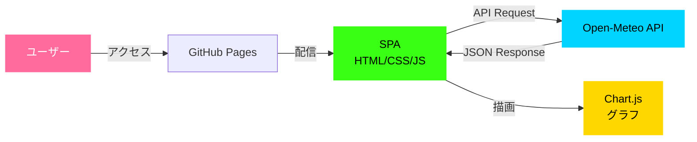
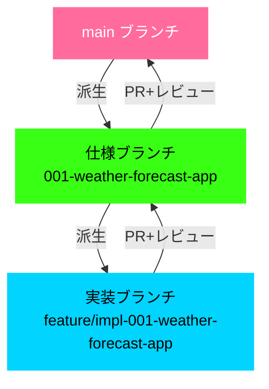

# Open-Meteo 気温予測アプリケーション

[](https://opensource.org/licenses/ISC)

Open-Meteo API を使用したサイバーパンク風の気温予測Webアプリケーション。

## 概要

世界の主要都市の気温を過去から未来まで可視化できるシングルページアプリケーション（SPA）です。Chart.js を使用したインタラクティブなグラフで、過去14日間から未来14日間までの気温推移を確認できます。

### システム構成



### 主な機能

- 🌍 世界の主要12都市の気温表示（Tokyo, Nagoya, Osaka, Fukuoka, Sapporo, New York, London, Paris, Sydney, Singapore, Dubai, Toronto）
- 📊 過去・未来の気温をChart.jsでグラフ可視化（過去14日間〜未来14日間）
- 🎨 サイバーパンク風のダークテーマ（緑ネオン・マゼンタ配色）
- 🌡️ 摂氏・華氏の切り替え（クライアント側計算）
- ⚡ パフォーマンス最適化（API 200ms以下、グラフ描画100ms以下）
- 📱 レスポンシブデザイン対応（max-width: 1600px, max-height: 900px）

## 技術スタック

- **フロントエンド**: HTML5, CSS3, JavaScript (ES6+)
- **グラフライブラリ**: Chart.js 4.x（CDN経由）
- **外部API**: [Open-Meteo Weather Forecast API v1](https://open-meteo.com/)
- **テスト**: Jest 30.x（ユニット）, Puppeteer 24.x（E2E）
- **開発サーバー**: http-server 14.x
- **ホスティング**: GitHub Pages

## 環境構築

### 前提条件

- Node.js 18.x 以上
- npm 9.x 以上

### インストール

```bash
# リポジトリをクローン
git clone https://github.com/J1921604/open-meteo.git
cd open-meteo

# 依存パッケージをインストール
npm install
```

### 開発サーバーの起動

```bash
.\start-app.ps1
```

このスクリプトは自動的にブラウザで http://localhost:8080 を開きます。

または、npm スクリプトで起動:

```bash
npm run serve
```

ブラウザで http://localhost:8080 にアクセスしてください。

### テスト実行

```bash
# 全テスト実行
npm test

# テスト監視モード
npm run test:watch

# カバレッジレポート生成
npm run test:coverage
```

## プロジェクト構成

```
open-meteo/
├── .github/
│   ├── copilot-instructions.md    # GitHub Copilot 開発ガイドライン
│   ├── prompts/                   # Speckit プロンプト
│   └── workflows/
│       └── deploy.yml             # GitHub Pages 自動デプロイ
├── .specify/
│   ├── memory/
│   │   └── constitution.md        # プロジェクト憲法
│   ├── templates/                 # 仕様・計画テンプレート
│   └── scripts/                   # 自動化スクリプト
├── docs/
│   └── DEPLOY_GUIDE.md            # GitHub Pages デプロイガイド
├── src/
│   ├── index.html                 # メインページ
│   ├── style.css                  # サイバーパンク風スタイル
│   └── script.js                  # API連携・グラフ描画ロジック
├── specs/
│   ├── 001-weather-forecast-app/           # 仕様ブランチ
│   │   ├── spec.md                # 機能仕様書
│   │   └── checklists/
│   │       └── requirements.md    # 要求仕様書
│   └── feature/
│       └── impl-001-weather-forecast-app/  # 実装ブランチ
│           ├── plan.md            # 実装計画（Phase 0-1）
│           ├── research.md        # 技術調査結果
│           ├── data-model.md      # データモデル定義
│           ├── quickstart.md      # 5分セットアップガイド
│           ├── tasks.md           # 実装タスクリスト
│           └── contracts/
│               └── open-meteo-api.yaml  # API契約（OpenAPI 3.0）
├── tests/
│   ├── unit/                      # ユニットテスト（Jest）
│   │   └── utils.test.js
│   └── integration/               # 統合テスト（Puppeteer）
│       └── app.test.js
├── start-app.ps1                  # 起動スクリプト (PowerShell)
├── .eslintrc.json                 # ESLint設定
├── package.json
└── README.md
```

## 使い方

1. **都市を選択**: ドロップダウンから表示したい都市を選択
2. **期間を調整**: 過去・未来のボタン（-14日、-7日、-1日、+1日、+7日、+14日）で表示期間を変更
3. **単位を切り替え**: トグルスイッチで摂氏（℃）と華氏（℉）を切り替え

## 開発ガイドライン

本プロジェクトは [プロジェクト憲法](https://github.com/J1921604/open-meteo/blob/main/.specify/memory/constitution.md) に定義された憲法に従います。

### 5つのコア原則

1. **テスト駆動開発の徹底**: テスト作成 → ユーザー承認 → テスト失敗確認 → 実装
2. **セキュリティ最優先**: XSS/CSRF対策、入力検証の必須化
3. **パフォーマンス定量化**: APIレスポンス200ms以下、初回ロード3秒以内など
4. **外部依存の再現性確保**: package-lock.jsonでバージョン固定
5. **仕様・実装乖離の検知と是正**: ドキュメントとコードの常時同期

### ブランチ戦略



```bash
# 仕様ブランチ（mainから派生）
git checkout main
git checkout -b spec/001-temperature-chart

# 実装ブランチ（仕様ブランチから派生）
git checkout spec/001-temperature-chart
git checkout -b feature/impl-001-temperature-chart
```

詳細は [憲法ドキュメント](https://github.com/J1921604/open-meteo/blob/main/.specify/memory/constitution.md) を参照してください。

## パフォーマンス目標

- **APIレスポンスタイム**: 200ms以下（95パーセンタイル）
- **初回ページロード**: 3秒以内（3G接続環境）
- **グラフ描画**: 100データポイントで100ms以下
- **メモリ使用量**: 100MB以下（ブラウザ）

## ライセンス

ISC License

## コントリビューション

1. このリポジトリをフォーク
2. 仕様ブランチを作成: `git checkout -b spec/001-new-feature`
3. 仕様ドキュメントを作成・コミット
4. 実装ブランチを作成: `git checkout -b feature/impl-001-new-feature`
5. テスト作成 → 実装 → コミット
6. プルリクエストを送信

## リンク

- [Open-Meteo API ドキュメント](https://open-meteo.com/en/docs)
- [Chart.js ドキュメント](https://www.chartjs.org/docs/latest/)
- [プロジェクト憲法](https://github.com/J1921604/open-meteo/blob/main/.specify/memory/constitution.md)
- [デプロイガイド](https://github.com/J1921604/open-meteo/blob/main/docs/DEPLOY_GUIDE.md)

---

**バージョン**: 1.0.0  
**最終更新**: 2025-12-15
