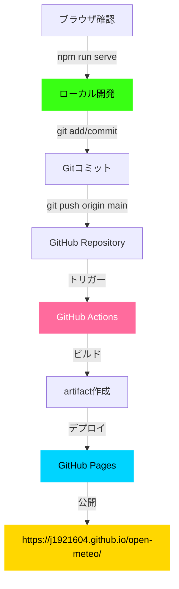
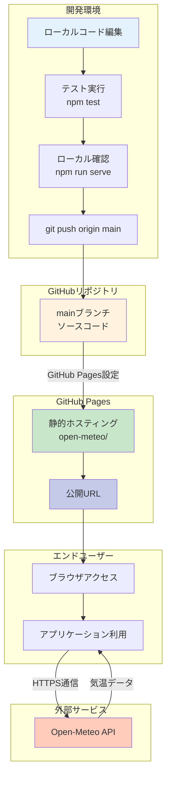
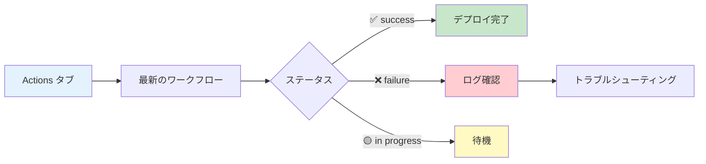
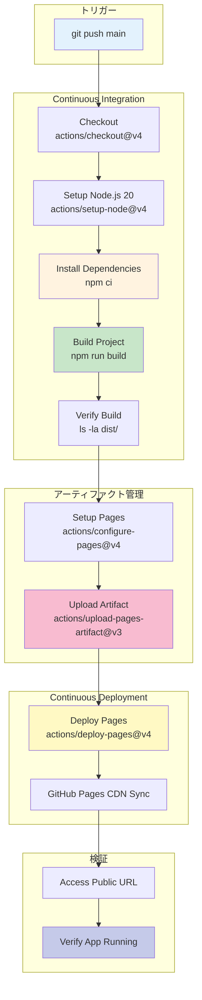

# GitHub Pages デプロイ完全ガイド

気温予測アプリケーションを GitHub Pages で公開するための完全なデプロイガイドです。

**バージョン**: 1.0.0  
**最終更新**: 2025-12-15  
**リポジトリ**: https://github.com/J1921604/open-meteo  
**公開URL**: https://j1921604.github.io/open-meteo/

---

## デプロイフロー



---

## 目次

1. [前提条件](#前提条件)
2. [自動デプロイ（GitHub Actions）](#自動デプロイgithub-actions)
3. [手動デプロイ](#手動デプロイ)
4. [デプロイ後の検証](#デプロイ後の検証)
5. [トラブルシューティング](#トラブルシューティング)
6. [更新手順](#更新手順)

---

## 前提条件

- GitHubアカウント
- リポジトリ: https://github.com/J1921604/open-meteo
- ローカルでの動作確認完了（`npm run serve`で確認）

---

## 自動デプロイ（GitHub Actions）

### 1. GitHub Pages設定（初回のみ必須）

1. リポジトリの **Settings** → **Pages** を開く
2. **Source**: 「**GitHub Actions**」を選択
3. 自動的に保存される

### 2. ワークフローファイル確認

`.github/workflows/deploy.yml`が存在することを確認:

```yaml
name: Deploy to GitHub Pages

on:
  push:
    branches:
      - main

permissions:
  contents: read
  pages: write
  id-token: write

concurrency:
  group: "pages"
  cancel-in-progress: true

jobs:
  build:
    runs-on: ubuntu-latest
    steps:
      - name: Checkout
        uses: actions/checkout@v4
      
      - name: Setup Pages
        uses: actions/configure-pages@v4
      
      - name: Upload artifact
        uses: actions/upload-pages-artifact@v3
        with:
          path: './src'
        
  deploy:
    environment:
      name: github-pages
      url: ${{ steps.deployment.outputs.page_url }}
    runs-on: ubuntu-latest
    needs: build
    steps:
      - name: Deploy to GitHub Pages
        id: deployment
        uses: actions/deploy-pages@v4
```

### 3. mainブランチにプッシュ

```bash
# mainブランチに切り替え（または001-weather-forecast-appブランチからマージ）
git checkout main
git merge 001-weather-forecast-app

# プッシュ
git add .
git commit -m "feat: 気温予測アプリケーション実装完了"
git push origin main
```

### 4. GitHub Actionsの実行確認

1. https://github.com/J1921604/open-meteo/actions を開く
2. 「Deploy to GitHub Pages」ワークフローが実行中であることを確認
3. ✅ 緑色のチェックマークが表示されたら成功（約1-2分）

### 5. 公開URLアクセス

```
https://j1921604.github.io/open-meteo/
```

✅ アプリケーションが表示されれば成功!

---

## 手動デプロイ

GitHub Actionsを使用しない場合の手順です。

### 1. GitHub Pagesの設定

1. GitHubリポジトリページにアクセス
2. `Settings`タブをクリック
3. 左メニューから `Pages`を選択
4. `Source`で以下のいずれかを選択:

   **方法A: GitHub Actions（推奨）**

   - `GitHub Actions`を選択

   **方法B: ブランチ指定**

   - `Deploy from a branch`を選択
   - Branch: `main`
   - Folder: `/src`（`/root`ではない）
   - `Save`ボタンをクリック

### 2. デプロイ実行

方法Bを選択した場合:

1. `Save`ボタンをクリック
2. 数分待つ
3. ページ上部に表示されるURLにアクセス

**注意**: 本アプリは静的HTML/CSS/JavaScriptのみのため、ビルドプロセスは不要です。

---

## デプロイ後の検証

### 1. 基本機能確認

- [ ] ページが正常に表示される
- [ ] ドロップダウンから都市を選択できる（Nagoya, Tokyo, New York, London, Paris）
- [ ] 都市選択後、グラフが表示される
- [ ] 過去データは緑ネオン実線で表示される
- [ ] 未来データはマゼンタ破線で表示される

### 2. 期間調整確認

- [ ] `-1日`, `-7日`, `-14日`ボタンが機能する
- [ ] `+1日`, `+7日`, `+14日`ボタンが機能する
- [ ] 選択中のボタンが発光している

### 3. 単位切り替え確認

- [ ] トグルスイッチで摂氏⇔華氏が切り替わる
- [ ] Y軸ラベルが `気温 (℃)`または `気温 (℉)`に更新される
- [ ] 温度値が正しく変換されている

### 4. ブラウザ互換性確認

- [ ] Chrome: 正常に動作
- [ ] Firefox: 正常に動作
- [ ] Safari: 正常に動作
- [ ] Edge: 正常に動作

---

## トラブルシューティング

### 問題1: 404 Not Found

**原因**: パスが正しくない、またはデプロイが完了していない

**解決策**:

1. GitHub Actions の実行ログを確認
2. `Settings` > `Pages` で `Source`設定を確認（`GitHub Actions`または `/src`フォルダ）
3. ブラウザのキャッシュをクリア（Ctrl+Shift+R）
4. `.github/workflows/deploy.yml`の `path`を確認（`'./src'`が正しい）

### 問題2: Chart.jsが読み込めない

**原因**: CDNへのアクセスがブロックされている

**解決策**:

- `src/index.html`のChart.js CDN URLを確認:
  ```html
  <script src="https://cdn.jsdelivr.net/npm/chart.js@4.4.0/dist/chart.umd.min.js"></script>
  ```
- ブラウザのコンソールでネットワークエラーを確認

### 問題3: APIエラーが表示される

**原因**: Open-Meteo APIへのリクエストが失敗

**解決策**:

1. ブラウザのコンソールでエラーメッセージを確認
2. Open-Meteo APIのステータスを確認: https://open-meteo.com/
3. CORS問題の確認（GitHub Pagesでは通常発生しない）

### 問題4: グラフが表示されない

**原因**: JavaScriptエラー、またはCanvas要素が見つからない

**解決策**:

1. ブラウザのコンソール（F12）でエラーを確認
2. `weatherChart`要素が存在するか確認
3. Chart.jsが正しく読み込まれているか確認

### 問題5: GitHub Actionsが失敗する

**原因**: 権限不足、またはワークフロー設定エラー

**解決策**:

1. `Settings` > `Pages` > `Source`が `GitHub Actions`になっているか確認
2. `Settings` > `Actions` > `General` > `Workflow permissions`を確認
   - `Read and write permissions`を選択
3. `.github/workflows/deploy.yml`の `path: './src'`を確認

---

## 更新手順

### コードを修正した場合

1. ローカルで修正
2. `npm run serve`で動作確認（http://localhost:8080）
3. コミット & プッシュ

```bash
git add .
git commit -m "fix: バグ修正"
git push origin main
```

4. GitHub Actionsが自動的に再デプロイ
5. 約1-2分後、https://j1921604.github.io/open-meteo/ で確認

### ローカル開発サーバー起動

```bash
# 方法1: ワンコマンド起動（推奨）
.\start-app.ps1

# 方法2: npm スクリプト
npm run serve
```

---

## カスタムドメインの設定（オプション）

独自ドメインを使用する場合:

1. `Settings` > `Pages` > `Custom domain`
2. ドメイン名を入力（例: `weather.example.com`）
3. DNSプロバイダーでCNAMEレコードを設定:
   ```
   weather.example.com. CNAME j1921604.github.io.
   ```
4. `Enforce HTTPS`にチェック

---

## まとめ

- **自動デプロイ**: mainブランチにプッシュすると自動的にGitHub Pagesにデプロイ
- **手動デプロイ**: `Settings` > `Pages`で設定可能
- **デプロイURL**: https://j1921604.github.io/open-meteo/
- **デプロイパス**: `/src`フォルダ（ビルド不要）
- **トラブルシューティング**: GitHub Actionsのログとブラウザコンソールを確認

---

**関連ドキュメント**:

- [README.md](https://github.com/J1921604/open-meteo/blob/main/README.md)
- [仕様書](https://github.com/J1921604/open-meteo/blob/main/specs/001-weather-forecast-app/spec.md)
- [完全仕様書](https://github.com/J1921604/open-meteo/blob/main/docs/完全仕様書.md)

---

**バージョン**: 1.0.0
**作成日**: 2025-12-15
**リポジトリ**: https://github.com/J1921604/open-meteo

---

## システム概要

### アーキテクチャ



### デプロイフロー概要

| ステップ        | 実行場所     | 処理内容                            | 所要時間        |
| --------------- | ------------ | ----------------------------------- | --------------- |
| 1. コミット     | ローカル     | `git push origin main`            | -               |
| 2. GitHub Pages | GitHub       | mainブランチのopen-meteo/を配信開始 | 即時            |
| 3. CDN反映      | GitHub Pages | CDN反映                             | 1-2分           |
| **合計**  | -            | -                                   | **1-2分** |

---

## 🚀 クイックスタート

### 前提条件

- ✅ Node.js 18.x 以上インストール済み
- ✅ npm 9.x 以上インストール済み
- ✅ Git インストール済み
- ✅ GitHubアカウント作成済み

### 5分でデプロイ

#### ステップ1: リポジトリクローン

```bash
git clone https://github.com/J1921604/open-meteo.git
cd open-meteo
```

#### ステップ2: ローカルテスト

```bash
# 依存関係インストール
npm install

# テスト実行
npm test

# ローカルプレビュー
npm run serve
# → http://localhost:8080 をブラウザで開く
```

#### ステップ3: 動作確認

ブラウザで以下を確認:

- ✅ ドロップダウンから都市を選択できる
- ✅ 気温グラフが表示される
- ✅ 期間調整ボタンが機能する
- ✅ 単位切り替えトグルが機能する
- ✅ レスポンシブデザインが適用されている

#### ステップ4: GitHub Pages設定（初回のみ必須）

**重要**: ワークフローを実行する前に、以下の設定を行う必要があります。

1. リポジトリの **Settings** → **Pages** を開く
2. **Source**: 「**GitHub Actions**」を選択
3. 自動的に保存される

#### ステップ5: デプロイ実行

```bash
# mainブランチへプッシュ
git checkout main
git pull origin main
git add .
git commit -m "Deploy: Initial release"
git push origin main
```

#### ステップ6: GitHub Actions確認

1. https://github.com/J1921604/open-meteo/actions を開く
2. 「Deploy to GitHub Pages」ワークフロー実行を確認
3. ✅ All jobs succeeded になるまで待つ(約2分)

#### ステップ7: 公開サイトアクセス

```
https://j1921604.github.io/open-meteo/
```

✅ アプリケーションが表示されれば成功!

---

## 🤖 自動デプロイ（GitHub Actions）

### ワークフロー設定

**ファイル**: `.github/workflows/deploy.yml`

```yaml
name: Deploy to GitHub Pages

on:
  push:
    branches:
      - main

permissions:
  contents: read
  pages: write
  id-token: write

concurrency:
  group: "pages"
  cancel-in-progress: true

jobs:
  build:
    runs-on: ubuntu-latest
    steps:
      - name: Checkout
        uses: actions/checkout@v4
        with:
          fetch-depth: 0
  
      - name: Setup Node.js
        uses: actions/setup-node@v4
        with:
          node-version: '20'
          cache: 'npm'
    
      - name: Install dependencies
        run: npm ci
jobs:
  build:
    runs-on: ubuntu-latest
    steps:
      - name: Checkout
        uses: actions/checkout@v4
    
      - name: Setup Pages
        uses: actions/configure-pages@v4
  
      - name: Upload artifact
        uses: actions/upload-pages-artifact@v3
        with:
          path: './open-meteo'
      
  deploy:
    environment:
      name: github-pages
      url: ${{ steps.deployment.outputs.page_url }}
    runs-on: ubuntu-latest
    needs: build
    steps:
      - name: Deploy to GitHub Pages
        id: deployment
        uses: actions/deploy-pages@v4
```

### 重要ポイント

#### 1. permissions設定

```yaml
permissions:
  contents: read   # ソースコード読み取り権限
  pages: write     # GitHub Pages書き込み権限
  id-token: write  # OIDC トークン発行権限
```

#### 2. 2段階ジョブ構成

- **build**: アーティファクトアップロード
- **deploy**: GitHub Pagesへのデプロイ

#### 3. アーティファクトアップロード

```yaml
- name: Upload artifact
  uses: actions/upload-pages-artifact@v3
  with:
    path: './open-meteo'
```

- ✅ **dist/のみ**をアップロード
- ❌ docs/, node_modules/, *.log は**含まれない**

### デプロイトリガー

以下のブランチへのプッシュで自動デプロイ:

- `main`

### デプロイ完了確認

#### GitHub Actions UI確認



---

## ⚙️ GitHub Pages設定

### Settings → Pages での設定方法

1. GitHubリポジトリを開く
2. **Settings** タブをクリック
3. 左側メニューから **Pages** を選択
4. **Source**: 「**GitHub Actions**」を選択

### 設定内容

| 設定項目 | 値             | 説明                       |
| -------- | -------------- | -------------------------- |
| Source   | GitHub Actions | カスタムワークフローを使用 |
| Branch   | 不要           | ワークフローが自動管理     |
| Folder   | 不要           | ワークフローが自動管理     |

**重要**: 本プロジェクトではGitHub Actions方式を採用しています。ビルドプロセスの完全制御、依存関係の自動管理、テスト統合が可能です。

---

## 🔍 トラブルシューティング

### 問題1: "Get Pages site failed" エラー

**エラーメッセージ**:

```
Error: Get Pages site failed. Please verify that the repository has Pages enabled 
and configured to build using GitHub Actions
```

**原因**: GitHub Pagesが有効化されていない、またはSourceが「GitHub Actions」に設定されていない

**解決策**:

1. リポジトリの **Settings** → **Pages** を開く
2. **Source** で「**GitHub Actions**」を選択
3. 保存を確認
4. ワークフローを再実行

**手順**:

```
Settings → Pages → Source: GitHub Actions を選択 → 保存
```

---

### 問題2: デプロイワークフローが失敗する

**症状**: GitHub Actionsワークフローが失敗する

**確認項目**:

1. **Settings → Pages で「GitHub Actions」が選択されているか確認**

   ```
   Settings → Pages → Source: GitHub Actions
   ```
2. **ワークフローログを確認**

   ```
   Actions タブ → 失敗したワークフロー → ログ確認
   ```
3. **permissions設定確認**

   ```yaml
   permissions:
     contents: read
     pages: write      # ← 必須
     id-token: write   # ← 必須
   ```

**解決策**:

Settings → Actions → General → Workflow permissions で「Read and write permissions」を選択

---

### 問題3: npm run build 失敗

**エラー**: `Module not found: sql.js`

**解決策**:

```powershell
# キャッシュクリア
npm cache clean --force

# node_modules削除
Remove-Item -Recurse -Force node_modules

# 再インストール
npm install

# ビルド
npm run build
```

**エラー**: `Cannot find module '@vitejs/plugin-react'`

**解決策**:

```powershell
# 開発依存関係を明示的にインストール
npm install --save-dev vite
```

---

### 問題4: GitHub Pagesに反映されない

**症状**: ビルド成功だが、URLにアクセスすると404

**原因1: ブラウザキャッシュ**

```
Ctrl+Shift+Delete → キャッシュクリア → 再読み込み
```

**原因2: base path設定誤り**

`vite.config.js` の `base` 設定がリポジトリ名と一致しているか確認:

```javascript
export default defineConfig({
  base: '/open-meteo/',  // ← リポジトリ名と一致させる
  // 例: リポジトリが github.com/J1921604/open-meteo なら '/open-meteo/'
  // 例: リポジトリが github.com/J1921604/my-app なら '/my-app/'
})
```

**修正が必要な場合**:

```powershell
# vite.config.js を編集
# base: '/間違った名前/' を base: '/正しいリポジトリ名/' に変更

# 再ビルド
npm run build

# コミット・プッシュ
git add vite.config.js
git commit -m "Fix: Update base path"
git push origin main
```

**原因3: デプロイ完了待ち**

初回デプロイは最大5分かかる場合があります。時間をおいて再度アクセスしてください。

---

### 問題5: WASMファイルが読み込めない

**エラー**: `Failed to load sql-wasm.wasm`

**確認**:

```powershell
# dist/内のWASMファイル確認
Get-ChildItem -Recurse -Filter *.wasm dist/
```

**解決策**: `vite.config.js` に以下が含まれているか確認

```javascript
export default defineConfig({
  assetsInclude: ['**/*.wasm'],
  server: {
    mime: {
      'application/wasm': ['wasm']
    }
  }
})
```

---

## ✅ デプロイ前チェックリスト

### ローカル環境

- [ ] `npm install` エラーなし
- [ ] `npm run test` 77/77 PASS
- [ ] `npm run build` エラーなし
- [ ] `npm run preview` でアプリが動作
- [ ] ファイルアップロード機能確認
- [ ] ソート機能確認（日付/名前、昇順/降順）

### Git/GitHub

- [ ] `.gitignore` に `node_modules/` `dist/` `*.log` 含む
- [ ] `main` ブランチが最新
- [ ] コミットメッセージが明確

### GitHub Actions

- [ ] `.github/workflows/deploy.yml` 存在
- [ ] `permissions: pages: write, id-token: write` 設定済み
- [ ] ワークフローが有効化されている

### GitHub Pages

- [ ] Settings → Pages で Source が「GitHub Actions」
- [ ] リポジトリが Public（または Pro アカウント）
- [ ] `vite.config.js` の base path正しい

### セキュリティ

- [ ] `.env` ファイルを `.gitignore` に含む
- [ ] APIキーなど機密情報を含まない
- [ ] CORS設定不要（完全クライアント側実行）

---

## 📊 CI/CDパイプライン詳細

### パイプライン全体像



### ビルドステップ詳細

| ステップ         | 処理内容                     | 成果物        | 失敗時の対応             |
| ---------------- | ---------------------------- | ------------- | ------------------------ |
| 1. Checkout      | ソースコードを取得           | -             | リポジトリアクセス権確認 |
| 2. Setup Node    | Node.js 20.x インストール    | node, npm     | バージョン確認           |
| 3. npm ci        | 依存関係インストール         | node_modules/ | package-lock.json 再生成 |
| 4. npm run build | Viteビルド実行               | dist/         | ローカルでビルド確認     |
| 5. Setup Pages   | GitHub Pages設定             | -             | 権限確認                 |
| 6. Upload        | アーティファクトアップロード | -             | サイズ確認（最大10GB）   |
| 7. Deploy        | GitHub Pagesへデプロイ       | -             | 権限確認                 |

### パフォーマンス指標

| 項目             | 目標   | 実績       |
| ---------------- | ------ | ---------- |
| ビルド時間       | < 60秒 | 30-40秒 ✅ |
| アップロード時間 | < 20秒 | 5-10秒 ✅  |
| デプロイ時間     | < 30秒 | 10-20秒 ✅ |
| CDN反映          | < 2分  | 1-2分 ✅   |
| 総所要時間       | < 5分  | 2-4分 ✅   |

### アーティファクト管理


- **mainブランチ**: ソースコード（src/, tests/, docs/）
- **アーティファクト**: ビルド成果物のみ（index.html, assets/, sql.js-wasm/）
- **不要ファイルは除外**: node_modules/, docs/, *.log

---

## 📚 関連ドキュメント

- [README.md](https://github.com/J1921604/open-meteo/blob/main/README.md) - プロジェクト概要
- [仕様書](https://github.com/J1921604/open-meteo/blob/main/specs/001-weather-forecast-app/spec.md) - 機能仕様書
- [DEPLOY_GUIDE.md](https://github.com/J1921604/open-meteo/blob/main/docs/DEPLOY_GUIDE.md) - デプロイ手順
- [GitHub Pages 公式ドキュメント](https://docs.github.com/pages)
- [GitHub Actions 公式ドキュメント](https://docs.github.com/actions)
- [リポジトリ](https://github.com/J1921604/open-meteo)

---
