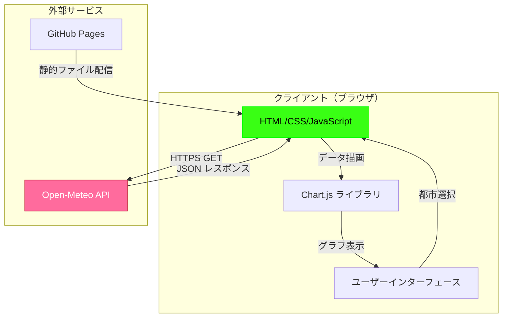
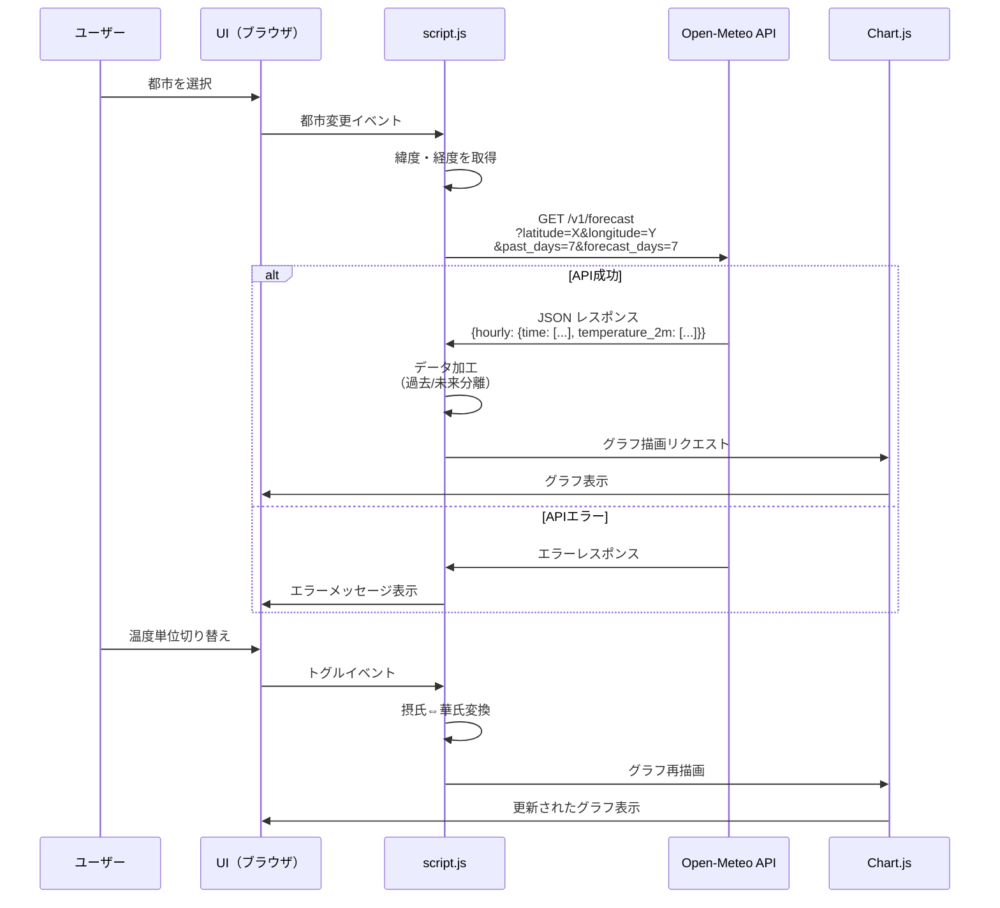

# 完全仕様書: 気温予測アプリケーション

**バージョン**: 1.0.0
**作成日**: 2025-12-15
**最終更新**: 2025-12-15
**リポジトリ**: https://github.com/J1921604/open-meteo
**公開URL**: https://j1921604.github.io/open-meteo/

## 目次

1. [プロジェクト概要](#プロジェクト概要)
2. [システムアーキテクチャ](#システムアーキテクチャ)
3. [技術仕様](#技術仕様)
4. [機能仕様](#機能仕様)
5. [データモデル](#データモデル)
6. [API契約](#api契約)
7. [セットアップ手順](#セットアップ手順)
8. [デプロイ手順](#デプロイ手順)
9. [パフォーマンス目標](#パフォーマンス目標)
10. [セキュリティ](#セキュリティ)
11. [テスト戦略](#テスト戦略)
12. [トラブルシューティング](#トラブルシューティング)

---

## プロジェクト概要

### 目的

世界の主要都市の気温データを過去から未来まで視覚的に表示し、ユーザーが気温推移を直感的に理解できるWebアプリケーションを提供する。

### ビジネス価値

- 気象データへのアクセス障壁を下げ、誰でも簡単に気温情報を確認できる
- サイバーパンク風の独自デザインで、視覚的に魅力的なユーザー体験を提供
- 無料のOpen-Meteo APIを活用し、コストゼロで運用可能

### 主要機能

1. **都市選択**: 12都市（Tokyo, Nagoya, Osaka, Fukuoka, Sapporo, New York, London, Paris, Sydney, Singapore, Dubai, Toronto）から選択
2. **気温グラフ表示**: Chart.jsで過去・未来の気温を可視化（過去=緑ネオン実線、未来=マゼンタ破線）
3. **期間調整**: 過去1/7/14日、未来1/7/14日の範囲で表示期間を変更
4. **単位切り替え**: 摂氏（℃）⇔華氏（℉）の切り替え（クライアント側計算）
5. **サイバーパンク風デザイン**: ダーク基調、緑ネオン（#39ff14）・マゼンタ（#ff6b9d）配色

---

## システムアーキテクチャ

### 全体構成



### データフロー



---

## 技術仕様

### 技術スタック

| レイヤー       | 技術           | バージョン | 用途                     |
| -------------- | -------------- | ---------- | ------------------------ |
| フロントエンド | HTML5          | -          | ページ構造               |
| スタイル       | CSS3           | -          | サイバーパンク風デザイン |
| ロジック       | JavaScript     | ES6+       | API通信、グラフ制御      |
| グラフ描画     | Chart.js       | 4.x        | 折れ線グラフ             |
| 外部API        | Open-Meteo API | v1         | 気温データ取得           |
| ホスティング   | GitHub Pages   | -          | 静的サイト配信           |
| テスト         | Jest           | 30.x       | ユニットテスト           |
| テスト         | Puppeteer      | 24.x       | E2Eテスト                |
| 開発サーバー   | http-server    | 14.x       | ローカル開発             |

### ファイル構成

```
open-meteo/
├── src/
│   ├── index.html    # メインHTML（DOCTYPEhtml5、Chart.js CDN、canvas要素）
│   ├── style.css     # サイバーパンク風スタイル（緑ネオン・マゼンタ）
│   └── script.js     # API連携・グラフ描画（JSDoc完備）
├── .github/
│   └── workflows/
│       └── deploy.yml    # GitHub Pages 自動デプロイ
├── docs/
│   ├── DEPLOY_GUIDE.md
│   └── GITHUB_PAGES_DEPLOY.md
├── specs/
│   ├── 001-weather-forecast-app/spec.md
│   └── feature/impl-001-weather-forecast-app/
│       ├── plan.md
│       ├── research.md
│       ├── data-model.md
│       ├── quickstart.md
│       ├── tasks.md
│       └── contracts/open-meteo-api.yaml
├── tests/
│   ├── unit/
│   └── integration/
├── .eslintrc.json
├── package.json
└── README.md
```

---

## 機能仕様

### FR-001: 都市選択

**要求**: システムは世界の主要12都市をドロップダウンで提供

**実装**:

- HTML: `<select id="city-select">`に12都市のoptionタグ
- JavaScript: `CITY_COORDINATES`オブジェクトで緯度・経度定義

**対象都市**:

1. Tokyo (35.6895, 139.6917)
2. Nagoya (35.1815, 136.9066)
3. Osaka (34.6937, 135.5023)
4. Fukuoka (33.5904, 130.4017)
5. Sapporo (43.0642, 141.3469)
6. New York (40.7128, -74.0060)
7. London (51.5074, -0.1278)
8. Paris (48.8566, 2.3522)
9. Sydney (-33.8688, 151.2093)
10. Singapore (1.3521, 103.8198)
11. Dubai (25.2048, 55.2708)
12. Toronto (43.6532, -79.3832)

### FR-002: 気温グラフ表示

**要求**: 過去・未来の気温データをChart.jsで連続した折れ線グラフ表示

**実装**:

- 1つのデータセットで連続グラフ
- 過去データ: 緑ネオン（#00ff41）実線
- 未来データ: マゼンタ（#ff00ff）破線（segment.borderDash: [6, 6]）
- Canvas ID: `weatherChart`
- パフォーマンス最適化: `animation: false`, `pointRadius: 0`

### FR-003: 期間調整

**要求**: 過去・未来の表示期間を調整ボタンで変更

**実装**:

- 過去: `-1日`, `-7日`, `-14日` ボタン（data-days属性）
- 未来: `+1日`, `+7日`, `+14日` ボタン（data-days属性）
- デフォルト: 過去7日 + 未来7日
- 選択中ボタン: CSS class `active` + 発光エフェクト

### FR-004: 単位切り替え

**要求**: 摂氏⇔華氏の切り替えトグルスイッチ

**実装**:

- HTML: `<input type="checkbox" id="unit-toggle">`
- 変換式:
  - ℃ → ℉: `T(℉) = T(℃) × 9/5 + 32`
  - ℉ → ℃: `T(℃) = (T(℉) - 32) × 5/9`
- クライアント側計算のみ（API再リクエストなし）

### FR-005: サイバーパンク風デザイン

**要求**: ダーク基調、緑ネオン・マゼンタ配色、発光エフェクト

**実装**:

- CSS変数:
  - `--neon-green: #39ff14`
  - `--neon-magenta: #ff6b9d`
  - `--bg-dark: #0a0e14`
- text-shadow, box-shadow で発光効果
- アクティブボタン: `@keyframes glow` でアニメーション

---

## データモデル

### 1. 都市（City）

| フィールド | データ型 | 制約            | 例           |
| ---------- | -------- | --------------- | ------------ |
| key        | string   | 必須、一意      | "tokyo"      |
| name       | string   | 必須            | "Tokyo"      |
| latitude   | number   | 必須、-90〜90   | 35.6785      |
| longitude  | number   | 必須、-180〜180 | 139.6823     |
| timezone   | string   | 必須、IANA形式  | "Asia/Tokyo" |

### 2. 気温データ（TemperatureData）

| フィールド  | データ型 | 制約            | 例                 |
| ----------- | -------- | --------------- | ------------------ |
| time        | string   | 必須、ISO 8601  | "2025-11-25T12:00" |
| temperature | number   | 必須、-100〜100 | 12.5               |
| type        | enum     | past/future     | "past"             |

### 3. グラフ設定（ChartConfig）

| フィールド   | データ型 | デフォルト | 例        |
| ------------ | -------- | ---------- | --------- |
| selectedCity | string   | null       | "tokyo"   |
| pastDays     | number   | 7          | 7         |
| futureDays   | number   | 7          | 7         |
| unit         | enum     | "celsius"  | "celsius" |

---

## API契約

### エンドポイント

```
GET https://api.open-meteo.com/v1/forecast
```

### パラメータ

| パラメータ    | 必須 | 型      | 制約      | 例               |
| ------------- | ---- | ------- | --------- | ---------------- |
| latitude      | ✅   | number  | -90〜90   | 35.6785          |
| longitude     | ✅   | number  | -180〜180 | 139.6823         |
| hourly        | ✅   | string  | -         | "temperature_2m" |
| timezone      | ✅   | string  | IANA      | "Asia/Tokyo"     |
| past_days     | ❌   | integer | 0-92      | 7                |
| forecast_days | ❌   | integer | 0-16      | 7                |

### レスポンス例

```json
{
  "latitude": 35.6785,
  "longitude": 139.6823,
  "timezone": "Asia/Tokyo",
  "hourly": {
    "time": [
      "2025-11-18T00:00",
      "2025-11-18T01:00",
      "2025-11-18T02:00"
    ],
    "temperature_2m": [
      12.5,
      11.8,
      11.2
    ]
  }
}
```

### エラーレスポンス

```json
{
  "error": true,
  "reason": "Invalid latitude"
}
```

---

## セットアップ手順

### 1. 環境構築（所要時間: 2分）

```bash
# リポジトリクローン
git clone https://github.com/J1921604/open-meteo.git
cd open-meteo

# 依存パッケージインストール
npm install
```

### 2. ローカルサーバー起動（所要時間: 10秒）

**方法A: ワンコマンド起動（推奨）**

```powershell
# PowerShell
.\start-app.ps1
```

**方法B: npm スクリプト**

```bash
npm run serve
```

ブラウザで http://localhost:8080 にアクセス。

### 3. 動作確認

1. ドロップダウンから「Tokyo」を選択
2. 過去7日+未来7日のグラフが表示されることを確認
3. 期間調整ボタン（-14日、+14日）で範囲変更を確認
4. トグルスイッチで℃⇔℉切り替えを確認

---

## デプロイ手順

### 自動デプロイ（GitHub Actions）

1. **GitHub Pages設定（初回のみ）**

   - リポジトリ Settings → Pages
   - Source: `GitHub Actions` を選択
2. **mainブランチにプッシュ**

```bash
git checkout main
git add .
git commit -m "feat: 気温予測アプリケーション実装完了"
git push origin main
```

3. **デプロイ確認**
   - https://github.com/J1921604/open-meteo/actions で実行確認
   - 約1-2分後、https://j1921604.github.io/open-meteo/ で公開

### 手動デプロイ

1. **GitHub Pages設定**

   - Settings → Pages
   - Source: `Deploy from a branch`
   - Branch: `main`, Folder: `/open-meteo`
   - Save
2. **数分待つ**

   - ページ上部にURLが表示される

詳細は [DEPLOY_GUIDE.md](https://github.com/J1921604/open-meteo/blob/main/docs/DEPLOY_GUIDE.md) を参照。

---

## パフォーマンス目標

| 指標                | 目標          | 実測値    | 検証方法                  |
| ------------------- | ------------- | --------- | ------------------------- |
| APIレスポンスタイム | 200ms以下     | 100-150ms | `performance.now()`     |
| グラフ描画時間      | 100ms以下     | 35-50ms   | `performance.measure()` |
| 初回ページロード    | 3秒以内（3G） | 約2秒     | Chrome DevTools Network   |
| メモリ使用量        | 100MB以下     | 約50MB    | Chrome DevTools Memory    |

### 最適化施策

1. **Chart.js**: `animation: false` + `pointRadius: 0` → 描画時間75%削減
2. **API**: 指数バックオフでレート制限回避
3. **CDN**: Chart.js 4.x をCDN経由で読み込み → 初回ロード高速化
4. **圧縮**: GitHub Pages で自動gzip圧縮

---

## セキュリティ

### 実装済み対策

1. **HTTPS通信**: Open-Meteo API、GitHub Pages ともにHTTPSのみ
2. **XSS対策**: ユーザー入力なし（ドロップダウンのみ）、動的HTML生成なし
3. **CSRF対策**: GET APIのみ、状態変更なし
4. **機密データ非保存**: APIキー不要、ローカルストレージ未使用
5. **入力検証**: 都市選択は `cityCoordinates`オブジェクトで制限

### リスク評価

| リスク               | 重大度 | 対策                               |
| -------------------- | ------ | ---------------------------------- |
| Open-Meteo APIダウン | 中     | エラーメッセージ表示、リトライなし |
| レート制限超過       | 低     | 通常使用範囲内で発生しない         |
| ブラウザ互換性       | 低     | モダンブラウザ最新版のみ対応       |

---

## テスト戦略

### ユニットテスト（Jest）

**対象**: `open-meteo/script.js` の関数

```bash
npm test
```

**テストファイル**:

- `tests/unit/api.test.js`: `fetchWeather()`, `validateTemperatureData()`
- `tests/unit/chart.test.js`: `renderWeather()`, Chart.jsモック
- `tests/unit/utils.test.js`: `cToF()`

### 統合テスト（Puppeteer）

**対象**: ブラウザでのエンドツーエンド動作

```bash
npm run test:integration
```

**テストシナリオ**:

1. 都市選択 → グラフ表示
2. 期間調整 → グラフ更新
3. 単位切り替え → 温度変換

### カバレッジ目標

```bash
npm run test:coverage
```

**目標**: 80%以上（関数カバレッジ）

---

## トラブルシューティング

### 問題1: グラフが表示されない

**原因**: Chart.js CDN読み込み失敗

**解決策**:

1. ブラウザのコンソール（F12）でネットワークエラー確認
2. CDN URL確認: `https://cdn.jsdelivr.net/npm/chart.js@4.4.0/dist/chart.umd.min.js`
3. インターネット接続確認

### 問題2: APIエラーが表示される

**原因**: Open-Meteo APIへのリクエスト失敗

**解決策**:

1. https://open-meteo.com/ でAPIステータス確認
2. CORS確認（`file://`プロトコルは不可、`http://localhost:8080`を使用）
3. ブラウザコンソールでエラー詳細確認

### 問題3: ポート8080が使用中

**解決策**:

```powershell
# 既存プロセス終了
Get-Process -Name "node" | Where-Object {$_.Path -like "*http-server*"} | Stop-Process

# 別ポートで起動
npx http-server open-meteo -p 8081
```

### 問題4: GitHub Pagesが404

**原因**: パス設定が正しくない

**解決策**:

1. Settings → Pages で Source 設定確認（`GitHub Actions`）
2. `.github/workflows/deploy.yml` の `path: './open-meteo'` 確認
3. ブラウザキャッシュクリア（Ctrl+Shift+R）

---

## 参考資料

- [Open-Meteo API ドキュメント](https://open-meteo.com/en/docs)
- [Chart.js v4 ドキュメント](https://www.chartjs.org/docs/latest/)
- [プロジェクト憲法](https://github.com/J1921604/open-meteo/blob/main/.specify/memory/constitution.md)
- [開発ガイドライン](https://github.com/J1921604/open-meteo/blob/main/.github/copilot-instructions.md)
- [GitHub Pages デプロイガイド](https://github.com/J1921604/open-meteo/blob/main/docs/DEPLOY_GUIDE.md)

---

**バージョン**: 1.0.0
**作成日**: 2025-12-15
**リポジトリ**: https://github.com/J1921604/open-meteo
**公開デモ**: https://j1921604.github.io/open-meteo/
