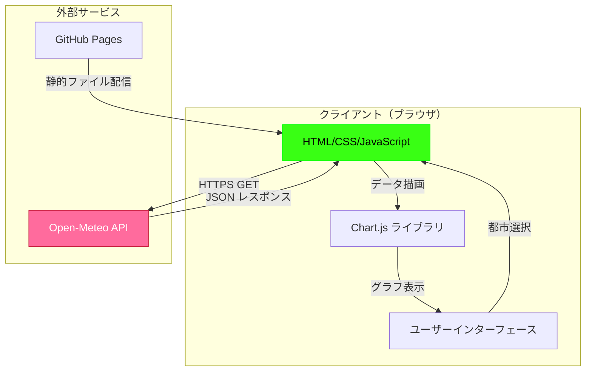
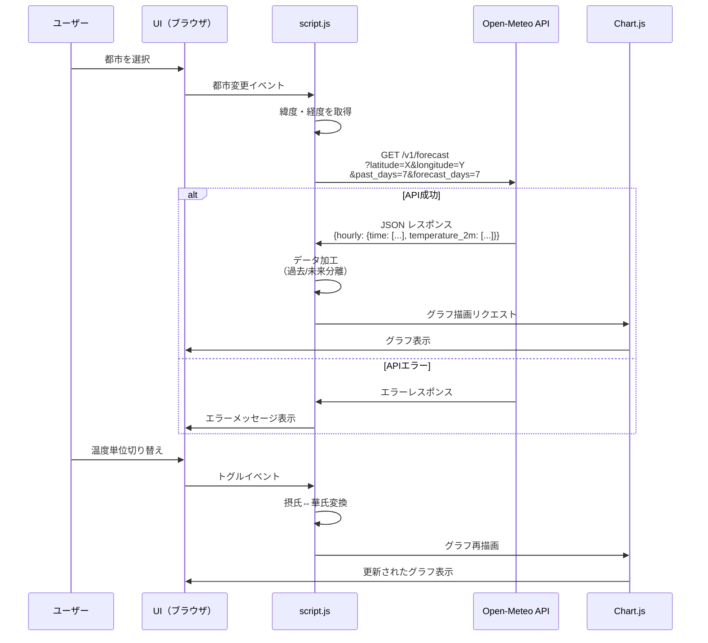
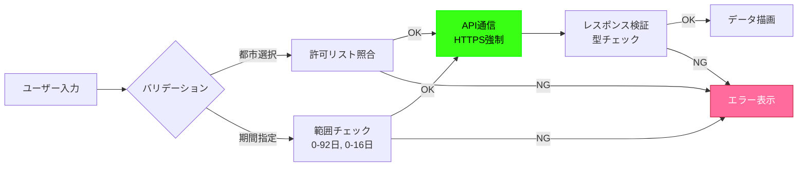

# 要求仕様書: 気温予測アプリケーション

**プロジェクト**: Open-Meteo Weather Forecast App
**バージョン**: 1.0.0
**作成日**: 2025-12-15

## 1. プロジェクト概要

### 1.1 目的

世界の主要都市の気温データを過去から未来まで視覚的に表示し、ユーザーが気温推移を直感的に理解できるWebアプリケーションを提供する。

### 1.2 ビジネス価値

- 気象データへのアクセス障壁を下げ、誰でも簡単に気温情報を確認できる
- サイバーパンク風の独自デザインで、視覚的に魅力的なユーザー体験を提供
- 無料のOpen-Meteo APIを活用し、コストゼロで運用可能

### 1.3 対象ユーザー

- 旅行計画を立てている個人
- 気温の推移を確認したい日常ユーザー
- 気象データに興味があるホビイスト
- サイバーパンクデザインに興味がある層

## 2. システムアーキテクチャ

### 2.1 全体構成



### 2.2 技術スタック

| レイヤー       | 技術           | バージョン | 用途                     |
| -------------- | -------------- | ---------- | ------------------------ |
| フロントエンド | HTML5          | -          | ページ構造               |
| スタイル       | CSS3           | -          | サイバーパンク風デザイン |
| ロジック       | JavaScript     | ES6+       | API通信、グラフ制御      |
| グラフ描画     | Chart.js       | 4.x        | 折れ線グラフ             |
| 外部API        | Open-Meteo API | v1         | 気温データ取得           |
| ホスティング   | GitHub Pages   | -          | 静的サイト配信           |

### 2.3 データフロー



## 3. 機能要件詳細

### 3.1 都市選択機能（FR-001, FR-002）

**入力**: ユーザーがドロップダウンから都市を選択
**処理**: 選択された都市の緯度・経度を取得し、API リクエストパラメータに設定
**出力**: Open-Meteo API へのHTTPSリクエスト送信

**都市マスターデータ**:

| 都市名      | 緯度     | 経度      | タイムゾーン        |
| ----------- | -------- | --------- | ------------------- |
| Tokyo       | 35.6785  | 139.6823  | Asia/Tokyo          |
| Nagoya      | 35.1815  | 136.9066  | Asia/Tokyo          |
| New York    | 40.7128  | -74.0060  | America/New_York    |
| London      | 51.5074  | -0.1278   | Europe/London       |
| Paris       | 48.8566  | 2.3522    | Europe/Paris        |
| Sydney      | -33.8688 | 151.2093  | Australia/Sydney    |
| Singapore   | 1.3521   | 103.8198  | Asia/Singapore      |
| Dubai       | 25.2048  | 55.2708   | Asia/Dubai          |
| Berlin      | 52.5200  | 13.4050   | Europe/Berlin       |
| Los Angeles | 34.0522  | -118.2437 | America/Los_Angeles |

### 3.2 気温データ取得機能（FR-003）

**API仕様**:

```
エンドポイント: https://api.open-meteo.com/v1/forecast
メソッド: GET
パラメータ:
  - latitude: 緯度（必須）
  - longitude: 経度（必須）
  - hourly: temperature_2m（必須）
  - timezone: タイムゾーン（必須、例: Asia/Tokyo）
  - past_days: 過去日数（0-92、デフォルト7）
  - forecast_days: 未来日数（0-16、デフォルト7）

レスポンス例:
{
  "latitude": 35.6785,
  "longitude": 139.6823,
  "timezone": "Asia/Tokyo",
  "hourly": {
    "time": [
      "2025-11-14T00:00",
      "2025-11-14T01:00",
      ...
    ],
    "temperature_2m": [
      12.5,
      11.8,
      ...
    ]
  }
}
```

### 3.3 グラフ描画機能（FR-004, FR-005, FR-011, FR-012）

**Chart.js 設定**:

```javascript
{
  type: 'line',
  data: {
    labels: ['11/14', '11/15', ...],  // MM/dd形式
    datasets: [
      {
        label: '過去の気温',
        data: [12.5, 13.2, ...],
        borderColor: '#39ff14',      // 緑ネオン
        borderWidth: 2,
        borderDash: [],              // 実線
        pointRadius: 0,              // マーカーなし
        fill: false
      },
      {
        label: '未来の気温',
        data: [14.0, 15.5, ...],
        borderColor: '#ff6b9d',      // マゼンタ
        borderWidth: 2,
        borderDash: [5, 5],          // 破線
        pointRadius: 0,
        fill: false
      }
    ]
  },
  options: {
    scales: {
      y: {
        title: { text: '気温 (℃)' },
        ticks: { stepSize: 1 }       // 1℃単位
      },
      x: {
        title: { text: '日付' }
      }
    },
    plugins: {
      legend: {
        labels: {
          usePointStyle: false,
          generateLabels: (chart) => {
            // 凡例テキストをグラフと同色に設定
          }
        }
      }
    }
  }
}
```

### 3.4 期間調整機能（FR-006, FR-007）

**ボタン配置**:

```
[ -14日 ] [ -7日 ] [ -1日 ]  [ +1日 ] [ +7日 ] [ +14日 ]
   ↑                               ↑
  過去期間                       未来期間
```

**動作仕様**:

- `-14日` クリック: `past_days=14, forecast_days=7` でAPI再リクエスト
- `+14日` クリック: `past_days=7, forecast_days=14` でAPI再リクエスト
- 複数ボタン併用可能（例: `-14日` + `+14日` → `past_days=14, forecast_days=14`）

### 3.5 温度単位切り替え機能（FR-008）

**トグルスイッチ仕様**:

```
初期状態:  [●○] ℃  
切替後:    [○●] ℉
```

**変換式**:

- 摂氏 → 華氏: `T(℉) = T(℃) × 9/5 + 32`
- 華氏 → 摂氏: `T(℃) = (T(℉) - 32) × 5/9`

**処理フロー**:

1. トグルクリック検知
2. 現在の温度配列を変換式で再計算
3. Chart.js の Y軸ラベルを更新（「気温 (℃)」 ⇔ 「気温 (℉)」）
4. グラフ再描画（API再リクエストなし）

## 4. 非機能要件

### 4.1 パフォーマンス要件

| 指標                | 目標値             | 測定方法                 |
| ------------------- | ------------------ | ------------------------ |
| APIレスポンスタイム | 200ms以下（P95）   | Performance API          |
| 初回ページロード    | 3秒以内（3G環境）  | Lighthouse               |
| グラフ描画時間      | 100ms以下（100点） | performance.mark/measure |
| メモリ使用量        | 100MB以下          | Chrome DevTools          |
| 同時API接続数       | 1接続のみ          | 実装制約                 |

### 4.2 セキュリティ要件



**セキュリティ対策**:

- XSS対策: ユーザー入力はドロップダウン選択のみ、テキスト入力なし
- HTTPS強制: API通信は必ず https:// 経由
- CSP設定: GitHub Pages のデフォルトCSPを使用
- 機密データなし: APIキー不要、個人情報収集なし

### 4.3 ユーザビリティ要件

- **レスポンシブデザイン**: 画面幅768px以下でモバイル最適化
- **アクセシビリティ**:
  - キーボード操作可能（Tab キーでフォーカス移動）
  - ARIAラベル設定（`aria-label="都市選択"`）
  - カラーコントラスト比 4.5:1 以上（WCAG AA準拠）
- **ローディングフィードバック**: API通信中はスピナー表示
- **エラーハンドリング**: エラー発生時は具体的なメッセージを日本語で表示

### 4.4 互換性要件

| ブラウザ | 最小バージョン | 対応状況    |
| -------- | -------------- | ----------- |
| Chrome   | 90+            | ✅ 完全対応 |
| Firefox  | 88+            | ✅ 完全対応 |
| Safari   | 14+            | ✅ 完全対応 |
| Edge     | 90+            | ✅ 完全対応 |
| IE11     | -              | ❌ 非対応   |

## 5. UIデザイン仕様

### 5.1 デザインシステム

**カラーパレット**:

```css
:root {
  --color-primary: #39ff14;        /* 緑ネオン */
  --color-accent: #ff6b9d;         /* マゼンタ */
  --color-bg-primary: #0a0e27;     /* ダーク背景 */
  --color-bg-secondary: #1a1f3a;   /* カード背景 */
  --color-text: #e0e6f0;           /* テキスト */
  --glow-primary: 0 0 10px #39ff14; /* 発光エフェクト */
}
```

**タイポグラフィ**:

```css
--font-family: 'Courier New', monospace;
--font-size-base: 16px;
--font-size-title: 24px;
```

### 5.2 レイアウト

```
┌─────────────────────────────────────────┐
│         気温予測アプリ                    │  ← タイトル
├─────────────────────────────────────────┤
│  [-- 主要都市を選択 --▼]  [●○] ℃       │  ← 都市選択 + 単位切替
├─────────────────────────────────────────┤
│  ┌───────────────────────────────────┐  │
│  │                                   │  │
│  │        グラフ表示エリア            │  │  ← Chart.js グラフ
│  │     （カード風、淡い青背景）        │  │
│  │                                   │  │
│  └───────────────────────────────────┘  │
├─────────────────────────────────────────┤
│  [-14日][-7日][-1日] [+1日][+7日][+14日] │  ← 期間調整ボタン
└─────────────────────────────────────────┘

最大サイズ: 1600px × 900px
中央揃え、レスポンシブ対応
```

## 6. テスト要件

### 6.1 ユニットテスト（Jest）

- 都市選択時の緯度・経度取得関数
- 摂氏⇔華氏変換関数
- APIレスポンスのデータ加工関数
- 日付フォーマット関数（MM/dd）

### 6.2 統合テスト（Puppeteer）

- E2Eシナリオ: 都市選択 → グラフ表示 → 期間変更 → 単位切替
- APIモック使用: 実際のOpen-Meteo APIは呼ばず、モックレスポンス使用
- パフォーマンステスト: グラフ描画時間測定

### 6.3 手動テスト

- 各ブラウザでの表示確認
- モバイルデバイス（iPhone, Android）での動作確認
- ネットワークエラー時の挙動確認

## 7. デプロイ要件

### 7.1 GitHub Pages 設定

```yaml
# .github/workflows/deploy.yml（将来対応）
name: Deploy to GitHub Pages
on:
  push:
    branches: [main]
jobs:
  deploy:
    runs-on: ubuntu-latest
    steps:
      - uses: actions/checkout@v2
      - name: Deploy
        uses: peaceiris/actions-gh-pages@v3
        with:
          github_token: ${{ secrets.GITHUB_TOKEN }}
          publish_dir: ./
```

### 7.2 ファイル構成

```
open-meteo/
├── index.html       # メインページ
├── style.css        # スタイルシート
├── script.js        # ロジック
└── README.md        # ドキュメント
```

### 7.3 ローカル開発環境

```bash
# http-server でローカルサーバー起動
npm install -g http-server
http-server . -p 8080
```

## 8. 運用要件

### 8.1 監視

- GitHub Pages のステータス監視（https://www.githubstatus.com/）
- Open-Meteo API の可用性監視（定期的な動作確認）

### 8.2 保守

- Chart.js のバージョンアップデート（年1回）
- ブラウザ互換性の定期確認（四半期ごと）
- Open-Meteo API 仕様変更の追従

### 8.3 サポート

- GitHub Issues でバグ報告受付
- README にFAQセクション追加

## 9. 成功指標（KPI）

| 指標               | 目標値      | 測定期間        |
| ------------------ | ----------- | --------------- |
| ページビュー       | 100PV/月    | リリース後1ヶ月 |
| 平均セッション時間 | 2分以上     | リリース後1ヶ月 |
| 直帰率             | 50%以下     | リリース後1ヶ月 |
| API成功率          | 99%以上     | 継続的          |
| ユーザー満足度     | 4.0/5.0以上 | アンケート調査  |

---

**承認**: 未承認
**次のステップ**: plan.md 作成、技術調査、タスク分解
