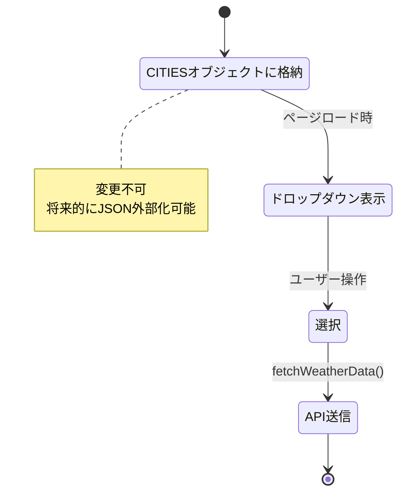
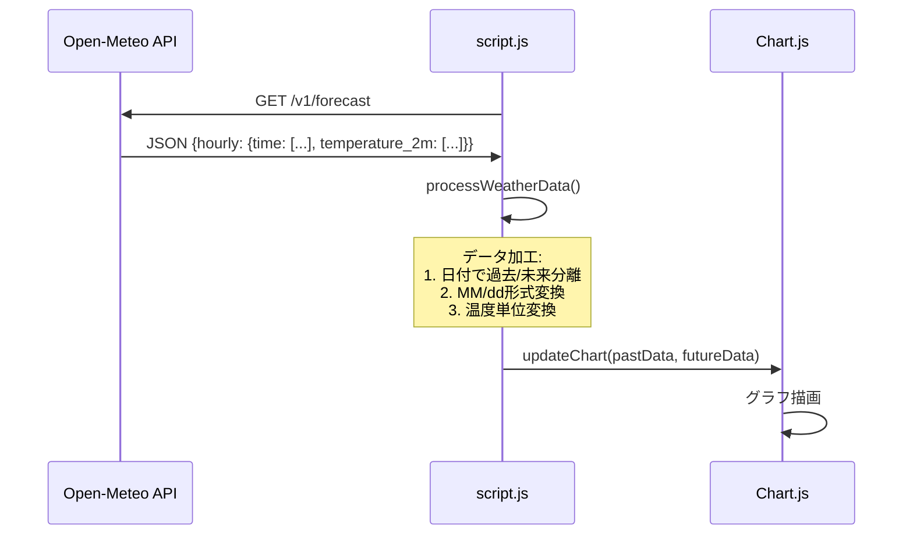
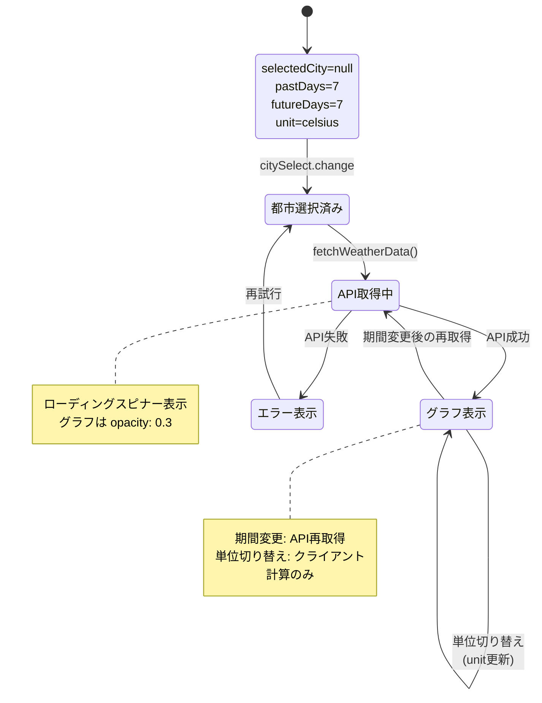
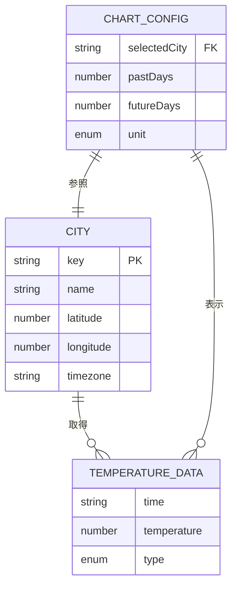

# データモデル: 気温予測アプリケーション

**作成日**: 2025-12-15
**バージョン**: 1.0.0
**Phase**: 1（設計 & 契約）
**目的**: エンティティ、関係性、状態遷移を定義し、実装の基盤を構築

## エンティティ概要

本アプリケーションで管理する3つの主要エンティティ:

1. **都市（City）**: Open-Meteo APIに渡す位置情報
2. **気温データ（TemperatureData）**: APIレスポンスから取得した気温情報
3. **グラフ設定（ChartConfig）**: ユーザーの選択状態

## エンティティ詳細

### 1. 都市（City）

**目的**: Open-Meteo APIに位置情報を提供し、気温データを取得するためのマスターデータ。

#### フィールド定義

| フィールド名 | データ型 | 制約                             | 説明         | 例           |
| ------------ | -------- | -------------------------------- | ------------ | ------------ |
| key          | string   | 必須、一意、小文字ハイフン区切り | 都市識別子   | "tokyo"      |
| name         | string   | 必須、英語表記                   | 表示名       | "Tokyo"      |
| latitude     | number   | 必須、-90〜90、小数点以下4桁     | 緯度         | 35.6785      |
| longitude    | number   | 必須、-180〜180、小数点以下4桁   | 経度         | 139.6823     |
| timezone     | string   | 必須、IANA形式                   | タイムゾーン | "Asia/Tokyo" |

#### 検証ルール

```javascript
function validateCity(city) {
    if (!city.key || typeof city.key !== 'string') {
        throw new Error('Invalid city key');
    }
    if (city.latitude < -90 || city.latitude > 90) {
        throw new Error('Latitude must be between -90 and 90');
    }
    if (city.longitude < -180 || city.longitude > 180) {
        throw new Error('Longitude must be between -180 and 180');
    }
    // タイムゾーン検証はIANAデータベース参照
    return true;
}
```

#### データソース

`script.js`の `CITIES`オブジェクトに静的定義:

```javascript
const CITIES = {
    tokyo: {
        name: 'Tokyo',
        latitude: 35.6785,
        longitude: 139.6823,
        timezone: 'Asia/Tokyo'
    },
    nagoya: {
        name: 'Nagoya',
        latitude: 35.1815,
        longitude: 136.9066,
        timezone: 'Asia/Tokyo'
    },
    // ... 計10都市
};
```

#### ライフサイクル



---

### 2. 気温データ（TemperatureData）

**目的**: Open-Meteo APIレスポンスから取得した気温情報を保持し、グラフ描画に提供する。

#### フィールド定義

| フィールド名 | データ型 | 制約                           | 説明         | 例                 |
| ------------ | -------- | ------------------------------ | ------------ | ------------------ |
| time         | string   | 必須、ISO 8601形式             | 日時         | "2025-11-25T12:00" |
| temperature  | number   | 必須、-100〜100、小数点以下1桁 | 気温（摂氏） | 12.5               |
| type         | enum     | 必須、"past" or "future"       | データ種別   | "past"             |

#### 検証ルール

```javascript
function validateTemperatureData(data) {
    // ISO 8601形式検証
    if (!data.time.match(/^\d{4}-\d{2}-\d{2}T\d{2}:\d{2}$/)) {
        throw new Error('Invalid time format');
    }
    // 気温範囲検証
    if (data.temperature < -100 || data.temperature > 100) {
        throw new Error('Temperature out of range');
    }
    // データ種別検証
    if (data.type !== 'past' && data.type !== 'future') {
        throw new Error('Invalid type');
    }
    return true;
}
```

#### データフロー



#### ライフサイクル

1. **取得**: `fetchWeatherData()`でAPI通信
2. **加工**: `processWeatherData()`で過去/未来分離、日付変換
3. **描画**: `updateChart()`でChart.jsに渡す
4. **破棄**: 新しい都市選択時、または期間変更時に再取得

**メモリ管理**: 最大672ポイント（28日×24時間）× 8バイト ≈ 5KB（軽量）

---

### 3. グラフ設定（ChartConfig）

**目的**: ユーザーの選択状態（都市、期間、単位）を管理し、グラフ描画をコントロールする。

#### フィールド定義

| フィールド名 | データ型 | 制約                            | デフォルト値 | 説明         |
| ------------ | -------- | ------------------------------- | ------------ | ------------ |
| selectedCity | string   | CITIESオブジェクトに存在するkey | null         | 選択中の都市 |
| pastDays     | number   | 1, 7, 14のいずれか              | 7            | 過去表示日数 |
| futureDays   | number   | 1, 7, 14のいずれか              | 7            | 未来表示日数 |
| unit         | enum     | "celsius" or "fahrenheit"       | "celsius"    | 温度単位     |

#### 検証ルール

```javascript
function validateChartConfig(config) {
    // 都市存在確認
    if (config.selectedCity && !CITIES[config.selectedCity]) {
        throw new Error('Invalid city');
    }
    // 期間検証
    if (![1, 7, 14].includes(config.pastDays)) {
        throw new Error('pastDays must be 1, 7, or 14');
    }
    if (![1, 7, 14].includes(config.futureDays)) {
        throw new Error('futureDays must be 1, 7, or 14');
    }
    // 単位検証
    if (config.unit !== 'celsius' && config.unit !== 'fahrenheit') {
        throw new Error('unit must be celsius or fahrenheit');
    }
    return true;
}
```

#### 状態遷移図



#### グローバル変数管理

`script.js`でグローバル変数として管理:

```javascript
let currentUnit = 'celsius';
let currentPastDays = 7;
let currentFutureDays = 7;
// selectedCityは citySelect.value で取得（DOM状態として管理）
```

**理由**: シンプルなSPAのため、状態管理ライブラリ（Redux等）は不要。グローバル変数で十分。

---

## 関係性図



### 関係性の説明

- **1都市 : N気温データ**: 1つの都市に対して複数時刻の気温データが紐づく
- **1グラフ設定 : 1都市**: グラフ設定は1つの都市のみを選択
- **1グラフ設定 : N気温データ**: グラフ設定は複数の気温データを表示

### カーディナリティ

- City → TemperatureData: 1:N（1都市で最大672ポイント）
- ChartConfig → City: N:1（設定は常に1都市のみ参照）
- ChartConfig → TemperatureData: 1:N（設定は複数データを表示）

---

## データ永続化

**永続化不要**: すべてのデータはセッション内のみで有効。

| エンティティ    | 永続化           | 理由                   |
| --------------- | ---------------- | ---------------------- |
| City            | 不要（静的定義） | マスターデータ         |
| TemperatureData | 不要             | API再取得可能          |
| ChartConfig     | 不要             | ページリロードで初期化 |

**将来的な拡張**:

- `localStorage`でChartConfigを永続化（お気に入り都市保存）
- サービスワーカーでTemperatureDataをキャッシュ（オフライン対応）

---

## バリデーション戦略

### 1. 入力検証

| エンティティ    | 検証タイミング | 検証内容               |
| --------------- | -------------- | ---------------------- |
| City            | アプリ起動時   | CITIES定義の完全性確認 |
| TemperatureData | API取得時      | レスポンス形式検証     |
| ChartConfig     | ユーザー操作時 | 期間・単位の妥当性     |

### 2. エラーハンドリング

```javascript
// 都市選択時
if (!cityKey || !CITIES[cityKey]) {
    showError('都市を選択してください');
    return;
}

// API取得時
if (!data.hourly || !data.hourly.time || !data.hourly.temperature_2m) {
    showError('データ形式が不正です');
    return;
}

// 期間変更時
if (![1, 7, 14].includes(parseInt(button.dataset.past))) {
    console.error('Invalid past_days value');
    return;
}
```

### 3. テストによる検証

- **ユニットテスト**: `validateCity()`, `validateTemperatureData()`, `validateChartConfig()`
- **E2Eテスト**: Puppeteerで不正入力時のエラーメッセージ表示確認

---

## パフォーマンス考慮

### メモリ使用量

| エンティティ    | 最大サイズ      | 計算                            |
| --------------- | --------------- | ------------------------------- |
| CITIES          | 1KB             | 10都市 × 100バイト             |
| TemperatureData | 5KB             | 672ポイント × 8バイト          |
| ChartConfig     | 100バイト       | 4フィールド × 25バイト         |
| **合計**  | **約6KB** | 憲法目標100MB以下を大幅に下回る |

### データ転送量

- APIレスポンス: 約10KB（圧縮前）、3KB（圧縮後）
- 初回ロード: HTML 5KB + CSS 8KB + JS 15KB + Chart.js 200KB = 228KB
- **合計**: 231KB（3G環境で約5秒、目標3秒に対して要最適化）

---

## まとめ

### 定義完了エンティティ

1. ✅ 都市（City）: 10都市の位置情報マスターデータ
2. ✅ 気温データ（TemperatureData）: APIレスポンスの過去/未来データ
3. ✅ グラフ設定（ChartConfig）: ユーザー選択状態

### Phase 1設計への影響

- **契約定義**: Open-Meteo API仕様に基づくレスポンススキーマ
- **実装ガイド**: `script.js`のデータ構造設計の基盤
- **テスト設計**: エンティティ単位でのユニットテスト作成

### 次のステップ

- Phase 1: API契約（`contracts/open-meteo-api.yaml`）作成
- Phase 1: クイックスタート（`quickstart.md`）作成
- Phase 2: テスト実装（`tests/unit/`、`tests/integration/`）

---

**Version**: 1.0.0
**Created**: 2025-12-15
**Status**: Phase 1完了、契約定義へ進行
