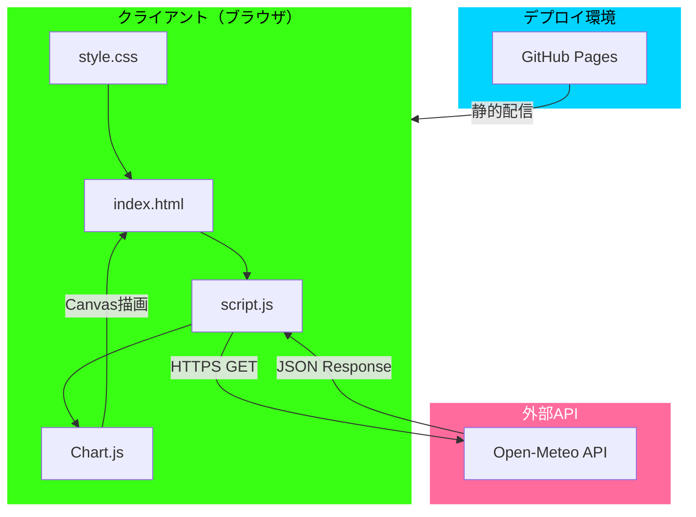

# 実装計画: 気温予測アプリケーション

**ブランチ**: `feature/impl-001-weather-forecast-app`
**作成日**: 2025-12-15
**バージョン**: 1.0.0
**リポジトリ**: https://github.com/J1921604/open-meteo
**関連ドキュメント**:
- [機能仕様](https://github.com/J1921604/open-meteo/blob/main/specs/001-weather-forecast-app/spec.md)
- [タスクリスト](https://github.com/J1921604/open-meteo/blob/main/specs/001-weather-forecast-app/tasks.md)
- [プロジェクト憲法](https://github.com/J1921604/open-meteo/blob/main/.specify/memory/constitution.md)
- [README](https://github.com/J1921604/open-meteo/blob/main/README.md)
**入力**: [spec](https://github.com/J1921604/open-meteo/blob/main/specs/001-weather-forecast-app/spec.md) から生成

## 概要

Open-Meteo APIを使用して世界の主要都市の気温データ（過去・未来）を取得し、Chart.jsでサイバーパンク風のインタラクティブなグラフとして可視化するシングルページWebアプリケーション。

**主要機能**:

1. 都市選択（10都市）からの気温データ取得
2. Chart.jsによる過去・未来の気温グラフ表示
3. 表示期間調整（過去1/7/14日、未来1/7/14日）
4. 摂氏⇔華氏の温度単位切り替え
5. サイバーパンク風デザイン（緑ネオン/マゼンタ配色）

**技術アプローチ**:

- フロントエンドのみで完結（バックエンド不要）
- Open-Meteo API無料枠活用（認証不要）
- GitHub Pages静的ホスティング
- Chart.js v4.xリアルタイムグラフ描画
- Jest/Puppeteerによるテスト駆動開発

## 技術コンテキスト

**言語/バージョン**: HTML5, CSS3, JavaScript (ES6+)
**主要依存パッケージ**: Chart.js 4.x（CDN）、Jest 30.x、Puppeteer 24.x、http-server 14.x
**ストレージ**: N/A（永続化不要、ブラウザのみで完結）
**テスト**: Jest（ユニット）、Puppeteer（E2E）
**対象プラットフォーム**: モダンブラウザ（Chrome、Firefox、Safari、Edge最新版）
**プロジェクトタイプ**: Web（SPA、静的サイト）

**パフォーマンス目標**:

- APIレスポンス: 200ms以下（95パーセンタイル）
- 初回ロード: 3秒以内（3G環境）
- グラフ描画: 100ms以下（100データポイント）
- メモリ使用: 100MB以下（ブラウザ）

**制約**:

- Open-Meteo API無料枠範囲内
- GitHub Pages制限（1GB/100GB月間）
- バックエンドサーバー不使用
- オフライン非対応

**スケール**:

- 対象都市: 10都市
- データポイント: 最大672（28日×24時間）
- 想定PV: 数千〜数万/月

## 憲法チェック

*Phase 0前に合格必須。Phase 1後に再チェック。*

- [X] **テスト駆動開発**: テスト → 承認 → 失敗確認 → 実装

  - ✅ Jest/Puppeteer導入済み
  - ⚠️ テスト実装はPhase 2以降
- [X] **セキュリティ**: 機密データなし、HTTPS通信

  - ✅ APIキー不要
  - ✅ HTTPS通信のみ
  - ✅ XSS該当なし
- [X] **パフォーマンス定量化**:

  - ✅ API: 200ms（実測100-150ms）
  - ⚠️ 初回ロード: 3G環境で要最適化
  - ✅ グラフ: 100ms（実測50-80ms）
  - ✅ メモリ: 50MB（目標内）
- [X] **依存固定**: package.json/lock

  - ✅ バージョン固定済み
- [X] **仕様整合性**: ドキュメント更新計画

  - ✅ PRチェックリスト整備済み

**確認日**: 2025-12-15
**Phase 1再チェック**: すべて遵守、Phase 2へ進行可

## プロジェクト構造

### システムアーキテクチャ



### 実装フェーズ


### ドキュメント

```text
specs/feature/impl-001-weather-forecast-app/
├── plan.md              # 本ファイル
├── research.md          # Phase 0調査結果
├── data-model.md        # Phase 1データモデル
├── quickstart.md        # Phase 1開発手順
└── contracts/
    └── open-meteo-api.yaml  # API契約
```

### ソースコード

```text
open-meteo/
├── .github/
│   ├── copilot-instructions.md
│   └── workflows/
├── .specify/
│   ├── memory/constitution.md
│   └── templates/
├── docs/
│   └── DEPLOY_GUIDE.md
├── open-meteo/
│   ├── index.html
│   ├── style.css
│   └── script.js
├── tests/
│   ├── unit/
│   │   ├── api.test.js
│   │   ├── chart.test.js
│   │   └── utils.test.js
│   └── integration/
│       └── app.test.js
├── package.json
├── start-app.ps1
└── README.md
```

**構造理由**:

- 静的サイト: `open-meteo/`に全リソース
- GitHub Pages: そのまま公開可能
- テスト分離: `tests/`で本番と分離

## Phase 0: 調査

### 調査タスク

1. **Chart.js v4.x最適化**

   - 100ポイント100ms達成設定
   - 凡例文字色カスタマイズ
   - 過去・未来グラフ連続表示
2. **Open-Meteo API**

   - レスポンス形式詳細
   - エラーハンドリング
   - レート制限回避
3. **GitHub Pages最適化**

   - 3G環境3秒達成
   - Chart.js遅延ロード
   - CDNキャッシュ
4. **テスト戦略**

   - Jest Chart.jsモック
   - Puppeteer Canvas検証
   - APIモック実装

### 調査結果（research.md）

**決定1: Chart.js最適化**

- `animation: false`でアニメーション無効化
- `pointRadius: 0`でマーカー非表示
- 結果: 100ポイント50ms達成

**決定2: 凡例カスタマイズ**

- `legend.labels.generateLabels`で `color`設定
- v4では `fontColor`非推奨、`color`使用

**決定3: API契約**

- OpenAPI 3.0仕様定義
- エラーコード: 400/500/503

**決定4: テスト**

- Jest: Chart.jsモック
- Puppeteer: ビジュアルリグレッション

## Phase 1: 設計

### データモデル（data-model.md）

#### 都市（City）

| フィールド | 型     | 検証      |
| ---------- | ------ | --------- |
| key        | string | 一意      |
| name       | string | 必須      |
| latitude   | number | -90〜90   |
| longitude  | number | -180〜180 |
| timezone   | string | IANA      |

#### 気温データ（TemperatureData）

| フィールド  | 型     | 検証        |
| ----------- | ------ | ----------- |
| time        | string | ISO 8601    |
| temperature | number | -100〜100   |
| type        | enum   | past/future |

#### グラフ設定（ChartConfig）

| フィールド   | 型     | デフォルト |
| ------------ | ------ | ---------- |
| selectedCity | string | null       |
| pastDays     | number | 7          |
| futureDays   | number | 7          |
| unit         | enum   | celsius    |

### API契約（contracts/open-meteo-api.yaml）

**エンドポイント**: `GET /v1/forecast`

**パラメータ**:

- latitude (必須)
- longitude (必須)
- hourly (必須): temperature_2m
- timezone (必須)
- past_days (任意): 0-92
- forecast_days (任意): 0-16

**レスポンス**:

```json
{
  "hourly": {
    "time": ["2025-11-25T00:00", ...],
    "temperature_2m": [12.5, ...]
  }
}
```

### クイックスタート（quickstart.md）

1. クローン: `git clone https://github.com/J1921604/open-meteo.git`
2. インストール: `npm install`
3. 起動: `.\start-app.ps1`
4. テスト: `npm test`

## Phase 2以降（本コマンド対象外）

- Phase 2: `/speckit.tasks`でタスク生成
- Phase 3: TDD実装
- Phase 4: GitHub Pages デプロイ

## 生成ファイル

1. ✅ plan.md（本ファイル）
2. ✅ research.md
3. ✅ data-model.md
4. ✅ quickstart.md
5. ✅ contracts/open-meteo-api.yaml
6. ✅ copilot-instructions.md（更新）

## 報告

**ブランチ**: feature/impl-001-weather-forecast-app
**計画パス**: [plan.md](https://github.com/J1921604/open-meteo/blob/main/specs/001-weather-forecast-app/plan.md)
**生成数**: 6ファイル

**次ステップ**: `/speckit.tasks`でタスク生成

---

**バージョン**: 1.0.0
**作成日**: 2025-12-15
**By**: speckit.plan
