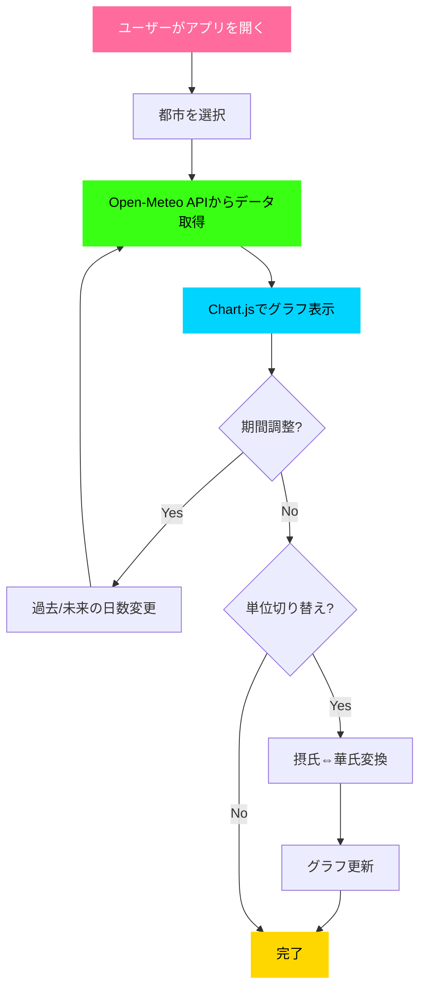
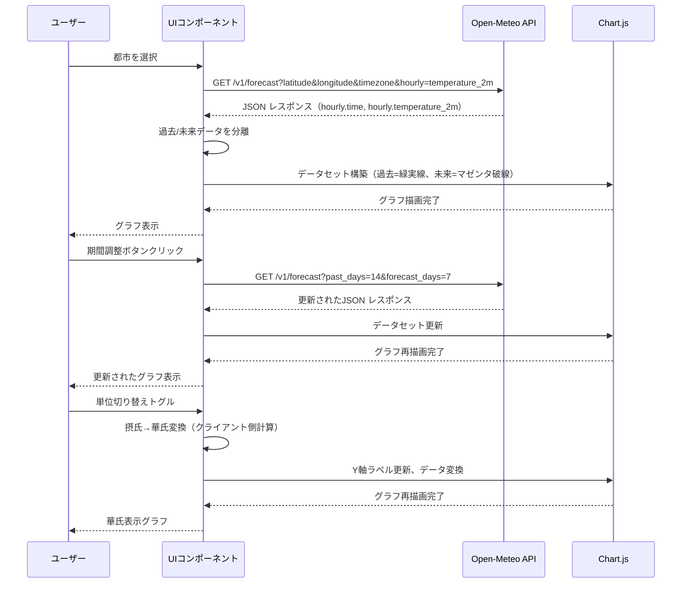
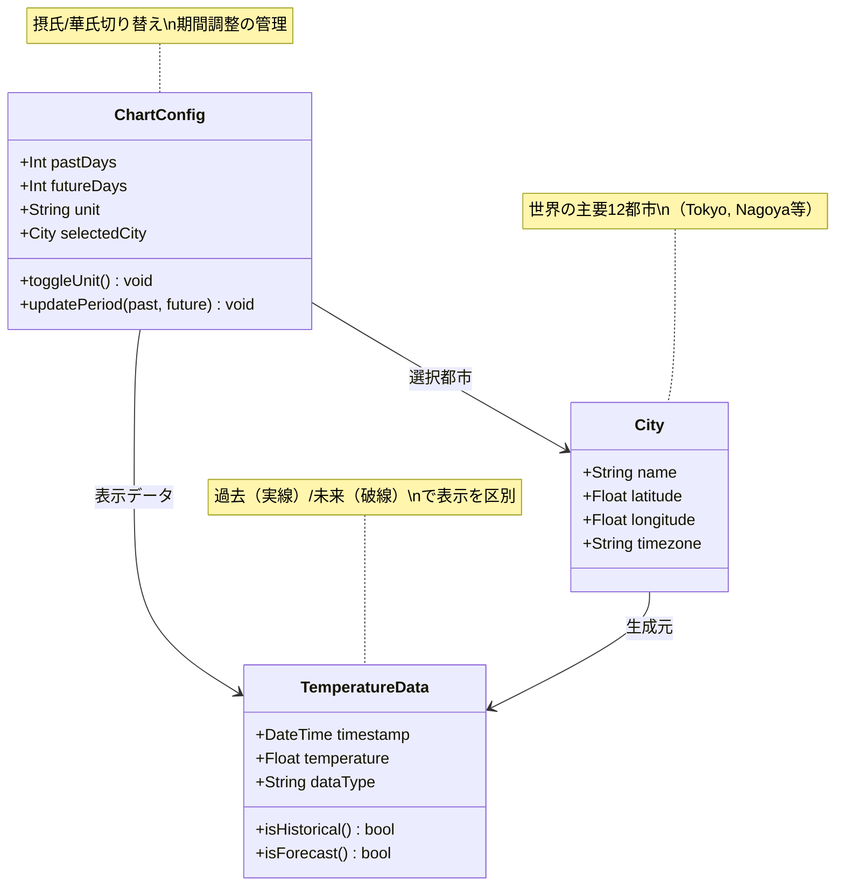

# 機能仕様: 気温予測アプリケーション

**機能ブランチ**: `001-weather-forecast-app`
**バージョン**: 1.0.0
**作成日**: 2025-12-15
**ステータス**: 実装完了
**リポジトリ**: https://github.com/J1921604/open-meteo
**関連ドキュメント**:
- [実装計画](https://github.com/J1921604/open-meteo/blob/main/specs/001-weather-forecast-app/plan.md)
- [タスクリスト](https://github.com/J1921604/open-meteo/blob/main/specs/001-weather-forecast-app/tasks.md)
- [プロジェクト憲法](https://github.com/J1921604/open-meteo/blob/main/.specify/memory/constitution.md)
- [README](https://github.com/J1921604/open-meteo/blob/main/README.md)

## ユーザーシナリオ & テスト *(必須)*

### 全体フロー

### データフロー

### ユーザーストーリー 1 - 都市選択と気温表示 (優先度: P1)

ユーザーは世界の主要都市を選択し、その都市の過去・未来の気温データをグラフで確認できる。

**この優先度の理由**: アプリケーションの中核機能。これがなければアプリとして成立しない。

**独立テスト**: ドロップダウンから都市を選択し、グラフが表示されることを確認。API通信とグラフ描画の基本機能を検証できる。

**受入シナリオ**:

1. **Given** ページが読み込まれている、**When** ユーザーがドロップダウンから「Tokyo」を選択する、**Then** Tokyo の緯度経度を使用してOpen-Meteo APIにリクエストが送信される
2. **Given** 都市が選択されている、**When** APIレスポンスが正常に返される、**Then** 過去7日間と未来7日間の気温データがグラフに折れ線で表示される
3. **Given** グラフが表示されている、**When** ユーザーがグラフを確認する、**Then** 過去データは緑ネオン実線、未来データはマゼンタ破線で表示される
4. **Given** グラフが表示されている、**When** 今日の日付を確認する、**Then** 横軸の今日の日付がマゼンタでハイライトされている

---

### ユーザーストーリー 2 - 表示期間の調整 (優先度: P2)

ユーザーは過去・未来の表示期間をボタンで調整し、より長期間または短期間のデータを確認できる。

**この優先度の理由**: 基本機能が動作する前提で、ユーザーが柔軟にデータを確認できる拡張機能。MVP後に追加価値を提供。

**独立テスト**: 期間調整ボタンをクリックし、グラフの表示範囲が変更されることを確認。API再リクエストとグラフ再描画を検証。

**受入シナリオ**:

1. **Given** 初期状態（±7日間表示）、**When** ユーザーが「-14日」ボタンをクリックする、**Then** 過去14日間、未来7日間のデータが表示される
2. **Given** 初期状態（±7日間表示）、**When** ユーザーが「+14日」ボタンをクリックする、**Then** 過去7日間、未来14日間のデータが表示される
3. **Given** 任意の期間が表示されている、**When** ユーザーが「-1日」または「+1日」ボタンをクリックする、**Then** それぞれ過去1日間、未来1日間のデータが表示される
4. **Given** 期間変更ボタンがクリックされる、**When** API リクエストが送信される、**Then** 新しい past_days / forecast_days パラメータでリクエストされる

---

### ユーザーストーリー 3 - 温度単位の切り替え (優先度: P3)

ユーザーは摂氏（℃）と華氏（℉）を切り替えて気温を確認できる。

**この優先度の理由**: ユーザビリティ向上のための補助機能。異なる地域のユーザーに配慮するが、中核機能には影響しない。

**独立テスト**: トグルスイッチをクリックし、グラフの温度表示と軸ラベルが変換されることを確認。

**受入シナリオ**:

1. **Given** 初期状態（摂氏表示）、**When** ユーザーがトグルスイッチをクリックする、**Then** グラフの温度が華氏に変換される（℃ → ℉: T(℉) = T(℃) × 9/5 + 32）
2. **Given** 華氏表示中、**When** ユーザーが再度トグルスイッチをクリックする、**Then** グラフの温度が摂氏に戻る
3. **Given** 単位切り替え時、**When** グラフが再描画される、**Then** Y軸ラベルが「気温 (℃)」または「気温 (℉)」に更新される
4. **Given** 単位切り替え時、**When** APIから取得したデータを変換する、**Then** クライアント側で計算され、API再リクエストは発生しない

---

### エッジケース

- **APIエラー時の動作**: API リクエストが失敗した場合（ネットワークエラー、タイムアウト、500エラー等）、ユーザーにエラーメッセージを表示し、グラフは空のまま
- **不正な都市選択**: ドロップダウンで「-- 主要都市を選択 --」が選択されている場合、グラフは表示せず、選択を促すメッセージを表示
- **APIレスポンス遅延**: API レスポンスが3秒以上かかる場合、ローディングインジケーター（スピナー）を表示
- **データ欠損**: API レスポンスに一部の時刻データが欠けている場合、その時刻のグラフポイントをスキップ（線を途切れさせる）
- **ブラウザ互換性**: Chrome、Firefox、Safari、Edge の最新版で動作することを確認
- **モバイル表示**: 画面幅が768px以下の場合、グラフが縮小表示され、ボタンが縦積みになる

## 要件 *(必須)*

### 機能要件

- **FR-001**: システムは世界の主要都市（Tokyo, New York, London, Paris, Sydney, Nagoyaを含む10都市以上）をドロップダウンリストで提供しなければならない
- **FR-002**: システムはユーザーが選択した都市の緯度・経度を使用して Open-Meteo API にリクエストを送信しなければならない
- **FR-003**: システムは取得した気温データ（hourly.temperature_2m）を折れ線グラフで表示しなければならない
- **FR-004**: グラフは過去データを緑ネオン（#39ff14）の実線、未来データをマゼンタ（#ff6b9d）の破線で描画しなければならない
- **FR-005**: グラフの横軸は日付（MM/dd形式）、縦軸は気温（1℃単位）で表示しなければならない
- **FR-006**: システムは過去データの表示期間を調整するボタン（-14日、-7日、-1日）を提供しなければならない
- **FR-007**: システムは未来データの表示期間を調整するボタン（+1日、+7日、+14日）を提供しなければならない
- **FR-008**: システムは摂氏と華氏を切り替えるトグルスイッチを提供しなければならない
- **FR-009**: システムはサイバーパンク風のデザイン（ダーク基調、緑ネオン/マゼンタ配色、発光エフェクト）を適用しなければならない
- **FR-010**: システムはレスポンシブデザインで、最大幅1600px、最大高さ900pxに対応しなければならない
- **FR-011**: グラフにはマーカー（データポイント）を表示せず、線のみで表現しなければならない
- **FR-012**: グラフの凡例テキストは対応するグラフの線と同色で表示しなければならない
- **FR-013**: システムは API レスポンスをブラウザの console.log で出力しなければならない（デバッグ用）
- **FR-014**: 気温情報の表示エリアはカード風デザインで、淡い青のグラデーション背景を持たなければならない
- **FR-015**: 初期表示時は過去7日間・未来7日間のデータをデフォルトで表示しなければならない

### 主要エンティティ

- **都市（City）**: 都市名、緯度、経度、タイムゾーン
- **気温データ（TemperatureData）**: 日時、気温値（摂氏）、データ種別（過去/未来）
- **グラフ設定（ChartConfig）**: 表示期間（過去日数、未来日数）、温度単位（摂氏/華氏）、選択都市

## 成功基準 *(必須)*

### 測定可能な成果

- **SC-001**: ユーザーは都市選択から気温グラフ表示まで3秒以内に完了できる
- **SC-002**: グラフは100データポイント（約4日分の時系列）を100ms以内に描画できる
- **SC-003**: API レスポンスタイムは95パーセンタイルで200ms以下である
- **SC-004**: ページ初回ロードは3G接続環境で3秒以内に完了する
- **SC-005**: ブラウザのメモリ使用量は100MB以下に維持される
- **SC-006**: 主要都市10都市について、APIから正常に気温データを取得できる成功率が99%以上である
- **SC-007**: ユーザーは温度単位切り替えを1クリックで即座に実行できる（再API通信なし）
- **SC-008**: 期間調整ボタンをクリックしてから新しいグラフが表示されるまで2秒以内である

## 想定

- Open-Meteo API は認証不要で、レート制限は通常使用範囲内では発生しない
- API レスポンス形式は公式ドキュメント（https://open-meteo.com/en/docs）に準拠している
- ユーザーは日本語環境のブラウザを使用しているが、UI は日本語テキストのみで構成（多言語化は将来対応）
- Chart.js ライブラリは CDN 経由で読み込み、バージョン 4.x 系を使用
- GitHub Pages での静的ホスティングを前提とし、サーバーサイド処理は不要
- ブラウザは JavaScript が有効になっている
- ユーザーのネットワーク環境はインターネット接続されている（オフライン対応は不要）

## 制約

- Open-Meteo API の無料枠を使用するため、過度なリクエストは避ける
- GitHub Pages の制限（ファイルサイズ1GB以下、帯域幅100GB/月）を遵守
- フロントエンドのみで完結し、バックエンドサーバーは使用しない
- ブラウザのローカルストレージに機密データは保存しない
- 外部ライブラリは最小限に抑え、Chart.js のみ使用

## スコープ外

- ユーザー認証・ログイン機能
- お気に入り都市の保存（ローカルストレージ使用も含む）
- 気温以外の気象データ（降水量、湿度、風速等）の表示
- データのエクスポート機能（CSV、PNG等）
- グラフのズーム・パン操作
- 複数都市の比較表示
- リアルタイム更新（自動リフレッシュ）
- プッシュ通知・アラート機能
- 多言語対応（英語、中国語等）
- ダークモード/ライトモードの切り替え（サイバーパンク風固定）

## 依存関係

- **外部API**: Open-Meteo Weather Forecast API (https://api.open-meteo.com/v1/forecast)
- **外部ライブラリ**: Chart.js v4.x（CDN経由）
- **ホスティング**: GitHub Pages
- **ブラウザ要件**: 最新版の Chrome, Firefox, Safari, Edge（ES6+ サポート必須）
