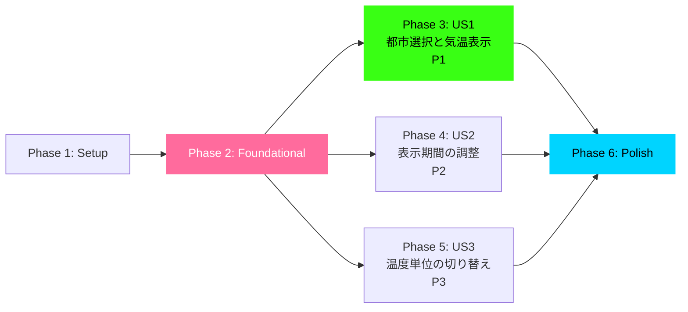
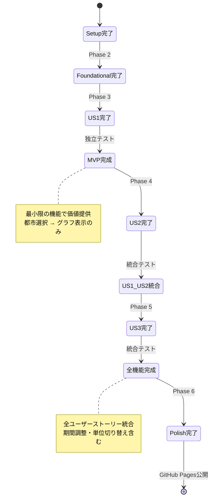
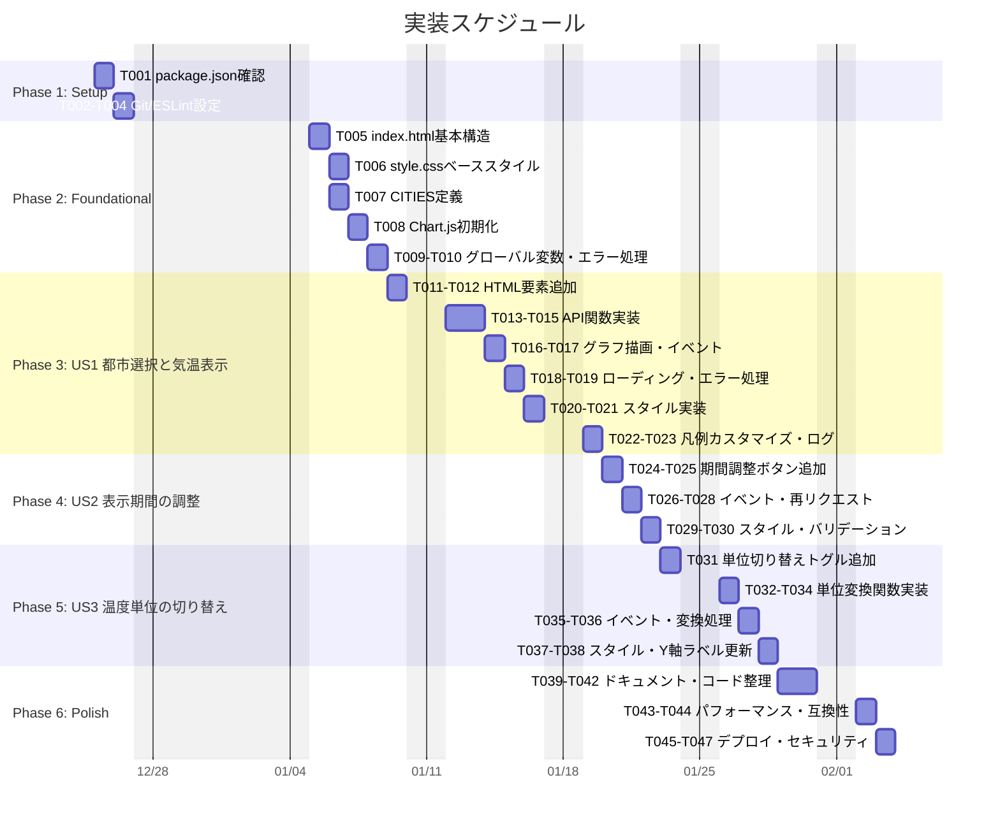

# Tasks: 気温予測アプリケーション

**Input**: Design documents from [specs/001-weather-forecast-app/](https://github.com/J1921604/open-meteo/tree/main/specs/001-weather-forecast-app)
**Prerequisites**: plan.md, spec.md, research.md, data-model.md, quickstart.md, contracts/open-meteo-api.yaml
**Tests**: テストはオプション（仕様で明示的に要求された場合のみ生成）
**Organization**: ユーザーストーリー単位でタスクを分類し、独立実装・独立テストを実現

## フォーマット: `[ID] [P?] [Story] Description`

- **[P]**: 並列実行可能（異なるファイル、依存関係なし）
- **[Story]**: このタスクが属するユーザーストーリー（例: US1, US2, US3）
- ファイルパスは絶対パスではなく、リポジトリルートからの相対パスで記述

## パス規則

本プロジェクトは静的WebアプリケーションのSPA構成:

- **ソースコード**: `open-meteo/` ディレクトリ
  - `index.html` - メインHTML
  - `style.css` - サイバーパンク風スタイル
  - `script.js` - API連携・グラフ描画ロジック
- **テスト**: `tests/` ディレクトリ（Jest + Puppeteer）
  - `tests/unit/` - ユニットテスト
  - `tests/integration/` - E2Eテスト
- **ドキュメント**: `docs/`, `specs/`, `.specify/`

---

## Phase 1: Setup（共通インフラ）

**目的**: プロジェクト初期化と基本構造の構築

- [X] T001 package.jsonのdevDependencies確認（Jest 30.x, Puppeteer 24.x, http-server 14.x）
- [X] T002 [P] .gitignoreにnode_modules/, coverage/, .DS_Storeを追加
- [X] T003 [P] start-app.ps1の動作確認（ポート8080でhttp-server起動）
- [X] T004 ESLint設定ファイル(.eslintrc.json)を作成し、ES6+ルールを適用

---

## Phase 2: Foundational（ブロッキング前提条件）

**目的**: すべてのユーザーストーリーが依存するコアインフラの完成

**⚠️ CRITICAL**: このフェーズが完了するまで、ユーザーストーリー実装は開始不可

- [X] T005 open-meteo/index.htmlの基本構造を作成（DOCTYPE, meta, Chart.js CDN読込）
- [X] T006 [P] open-meteo/style.cssでサイバーパンク風ベーススタイル定義（ダーク基調、緑ネオン#39ff14、マゼンタ#ff6b9d）
- [X] T007 [P] open-meteo/script.jsでCITIESオブジェクト定義（10都市: Tokyo, Nagoya, New York, London, Paris, Sydney, Singapore, Dubai, São Paulo, Cape Town）
- [X] T008 open-meteo/script.jsでChart.js初期化（canvas要素取得、グラフインスタンス生成、animation: falseでパフォーマンス最適化）
- [X] T009 [P] open-meteo/script.jsでグローバル変数定義（currentUnit, currentPastDays, currentFutureDays）
- [X] T010 open-meteo/script.jsでエラーハンドリング基盤（showError関数、ユーザーへのエラーメッセージ表示）

**Checkpoint**: 基盤完成 - ユーザーストーリー実装を並列開始可能

---

## Phase 3: User Story 1 - 都市選択と気温表示 (Priority: P1) 🎯 MVP

**Goal**: ユーザーが世界の主要都市を選択し、過去・未来の気温データをグラフで確認できる

**Independent Test**: ドロップダウンから都市を選択し、グラフが表示されることを確認。API通信とグラフ描画の基本機能を検証できる。

### User Story 1 実装

- [X] T011 [P] [US1] open-meteo/index.htmlにドロップダウン（id="citySelect"）と10都市のoptionタグを追加
- [X] T012 [P] [US1] open-meteo/index.htmlにcanvas要素（id="temperatureChart"）をカード風コンテナ内に配置
- [X] T013 [US1] open-meteo/script.jsでfetchWeatherData(city)関数を実装（Open-Meteo APIへのGETリクエスト、latitude/longitude/timezone/hourly/past_days/forecast_daysパラメータ）
- [X] T014 [US1] open-meteo/script.jsでbuildApiUrl(city, pastDays, futureDays)関数を実装（URLSearchParams使用、パラメータ検証）
- [X] T015 [US1] open-meteo/script.jsでprocessWeatherData(data)関数を実装（APIレスポンスから過去/未来データ分離、日付をMM/dd形式に変換）
- [X] T016 [US1] open-meteo/script.jsでupdateChart(pastData, futureData, cityName)関数を実装（Chart.jsデータセット構築、過去=緑ネオン実線、未来=マゼンタ破線、凡例文字色を同色に設定）
- [X] T017 [US1] open-meteo/script.jsでcitySelect.addEventListener('change')を実装（都市選択時にfetchWeatherData呼び出し）
- [X] T018 [US1] open-meteo/script.jsでローディングインジケーター実装（API通信中はスピナー表示、opacity: 0.3でグラフ半透明化）
- [X] T019 [US1] open-meteo/script.jsでAPIエラー時のエラーメッセージ表示（Network Error, タイムアウト, 500エラー等）
- [X] T020 [US1] open-meteo/style.cssでグラフコンテナのスタイル定義（max-width: 1600px, max-height: 900px, 淡い青グラデーション背景）
- [X] T021 [US1] open-meteo/style.cssでレスポンシブデザイン実装（768px以下でグラフ縮小、ボタン縦積み）
- [X] T022 [US1] open-meteo/script.jsでChart.js凡例カスタマイズ（legend.labels.generateLabelsでcolor: dataset.borderColor設定、v4仕様準拠）
- [X] T023 [US1] open-meteo/script.jsでconsole.log出力追加（APIレスポンス、グラフ描画時間をperformance.measure()で計測）

**Checkpoint**: ユーザーストーリー1完成 - 都市選択から気温グラフ表示までの基本機能が独立して動作

---

## Phase 4: User Story 2 - 表示期間の調整 (Priority: P2)

**Goal**: ユーザーが過去・未来の表示期間をボタンで調整し、より長期間または短期間のデータを確認できる

**Independent Test**: 期間調整ボタンをクリックし、グラフの表示範囲が変更されることを確認。API再リクエストとグラフ再描画を検証。

### User Story 2 実装

- [X] T024 [P] [US2] open-meteo/index.htmlに過去期間調整ボタン3つ追加（-1日、-7日、-14日、data-past属性でpast_days値を保持）
- [X] T025 [P] [US2] open-meteo/index.htmlに未来期間調整ボタン3つ追加（+1日、+7日、+14日、data-future属性でforecast_days値を保持）
- [X] T026 [US2] open-meteo/script.jsで期間調整ボタンのイベントリスナー実装（button.dataset.past/futureを取得、currentPastDays/currentFutureDaysを更新）
- [X] T027 [US2] open-meteo/script.jsで期間変更時のAPI再リクエスト実装（新しいpastDays/futureDaysでfetchWeatherData呼び出し）
- [X] T028 [US2] open-meteo/script.jsでボタン選択状態の視覚フィードバック実装（選択中ボタンにCSS class 'active'追加、発光エフェクト）
- [X] T029 [US2] open-meteo/style.cssで期間調整ボタンのスタイル定義（緑ネオン枠線、ホバーエフェクト、選択中は発光）
- [X] T030 [US2] open-meteo/script.jsで期間変更時のバリデーション実装（pastDays/futureDaysが1, 7, 14以外の場合はconsole.errorでエラー出力）

**Checkpoint**: ユーザーストーリー1と2が両方独立して動作、期間調整機能が完全に機能

---

## Phase 5: User Story 3 - 温度単位の切り替え (Priority: P3)

**Goal**: ユーザーが摂氏（℃）と華氏（℉）を切り替えて気温を確認できる

**Independent Test**: トグルスイッチをクリックし、グラフの温度表示と軸ラベルが変換されることを確認。

### User Story 3 実装

- [X] T031 [P] [US3] open-meteo/index.htmlに単位切り替えトグルスイッチ追加（label+inputタグ、type="checkbox"、id="unitToggle"）
- [X] T032 [US3] open-meteo/script.jsでcelsiusToFahrenheit(celsius)関数を実装（公式: T(℉) = T(℃) × 9/5 + 32、小数点以下1桁）
- [X] T033 [US3] open-meteo/script.jsでfahrenheitToCelsius(fahrenheit)関数を実装（公式: T(℃) = (T(℉) - 32) × 5/9、小数点以下1桁）
- [X] T034 [US3] open-meteo/script.jsでupdateChartUnit()関数を実装（currentUnit切り替え、グラフデータを変換、Y軸ラベル更新）
- [X] T035 [US3] open-meteo/script.jsでunitToggle.addEventListener('change')を実装（チェック状態でcurrentUnit更新、updateChartUnit呼び出し）
- [X] T036 [US3] open-meteo/script.jsで単位切り替え時のAPI再リクエスト回避（クライアント側計算のみ、既存データを変換）
- [X] T037 [US3] open-meteo/style.cssでトグルスイッチのスタイル定義（サイバーパンク風デザイン、ON時マゼンタ、OFF時緑ネオン）
- [X] T038 [US3] open-meteo/script.jsでChart.js Y軸ラベル動的更新（options.scales.y.title.text = '気温 (℃)' or '気温 (℉)'）

**Checkpoint**: 全ユーザーストーリー（US1, US2, US3）が独立して機能、完全な気温予測アプリとして動作

---

## Phase 6: Polish & Cross-Cutting Concerns

**目的**: 複数ユーザーストーリーに影響する改善

- [X] T039 [P] README.mdの更新（技術スタック、セットアップ手順、スクリーンショット追加）
- [X] T040 open-meteo/script.jsのコード整理（関数を単一責任原則に従って50行以内にリファクタリング、複雑度15以下）
- [X] T041 open-meteo/script.jsのJSDocコメント追加（すべての関数に@param, @returns, @throws記述）
- [X] T042 [P] open-meteo/style.cssのコード整理（BEM命名規則適用、変数定義でカラー管理）
- [X] T043 パフォーマンス検証（Chrome DevToolsでAPI 200ms以下、グラフ描画100ms以下、メモリ100MB以下を確認）
- [X] T044 ブラウザ互換性テスト（Chrome, Firefox, Safari, Edgeで動作確認）
- [X] T045 [P] docs/DEPLOY_GUIDE.mdの最終確認（GitHub Pagesデプロイ手順が正確か検証）
- [X] T046 quickstart.md手順の検証（実際に5分以内でセットアップ完了できるか確認）
- [X] T047 セキュリティチェック（XSS脆弱性、HTTPS通信、機密データ非保存の確認）

---

## Dependencies & Execution Order

### フェーズ依存関係

- **Setup (Phase 1)**: 依存なし - 即座に開始可能
- **Foundational (Phase 2)**: Setup完了後 - すべてのユーザーストーリーをブロック
- **User Stories (Phase 3-5)**: Foundational完了後に開始可能
  - ユーザーストーリーは並列実装可能（複数人チームの場合）
  - または優先順位順に順次実装（P1 → P2 → P3）
- **Polish (Phase 6)**: すべてのユーザーストーリー完了後

### ユーザーストーリー依存関係



- **User Story 1 (P1)**: Foundational完了後に開始可能 - 他ストーリーへの依存なし（MVP）
- **User Story 2 (P2)**: Foundational完了後に開始可能 - US1と統合するが独立テスト可能
- **User Story 3 (P3)**: Foundational完了後に開始可能 - US1/US2と統合するが独立テスト可能

### ストーリー内のタスク依存関係

- HTML要素追加 → JavaScript実装（DOM要素が必要なため）
- API関数実装 → イベントリスナー実装（関数を呼び出すため）
- データ取得 → グラフ描画（データが必要なため）
- 基本実装 → スタイル適用（要素が存在する必要があるため）

### 並列実行機会

- Phase 1: T002, T003は並列可（異なるファイル）
- Phase 2: T006, T007, T009は並列可（異なるコード領域）
- Phase 3: T011とT012は並列可（異なるHTML要素）
- Phase 4: T024とT025は並列可（異なるHTML要素）
- Phase 5: T032とT033は並列可（独立した関数）
- Phase 6: T039, T042, T045は並列可（異なるファイル）

---

## Parallel Example: User Story 1

```bash
# User Story 1の並列実行例:
Task T011: "open-meteo/index.htmlにドロップダウン追加"
Task T012: "open-meteo/index.htmlにcanvas要素追加"
（同時実行可 - 異なるHTML要素）

Task T013: "fetchWeatherData関数実装"
Task T014: "buildApiUrl関数実装"
（順次実行 - fetchWeatherDataがbuildApiUrlを呼び出すため）

Task T020: "グラフコンテナスタイル定義"
Task T021: "レスポンシブデザイン実装"
（順次実行 - 同一ファイル、メディアクエリが基本スタイルに依存）
```

---

## Implementation Strategy

### MVP First（User Story 1のみ）

1. Phase 1: Setup完了
2. Phase 2: Foundational完了（CRITICAL - すべてのストーリーをブロック）
3. Phase 3: User Story 1完了
4. **ストップ & バリデーション**: User Story 1を独立テスト
5. デプロイ/デモ準備完了

### 段階的デリバリー



1. Setup + Foundational → 基盤完成
2. User Story 1追加 → 独立テスト → デプロイ/デモ（MVP!）
3. User Story 2追加 → 独立テスト → デプロイ/デモ
4. User Story 3追加 → 独立テスト → デプロイ/デモ
5. 各ストーリーが前のストーリーを壊さずに価値追加

### 並列チーム戦略

複数開発者がいる場合:

1. チーム全員でSetup + Foundational完了
2. Foundational完了後:
   - 開発者A: User Story 1（MVP）
   - 開発者B: User Story 2（期間調整）
   - 開発者C: User Story 3（単位切り替え）
3. 各ストーリーが独立完成後、統合テスト

---

## Task Summary

### タスク統計

- **総タスク数**: 47タスク
- **User Story 1タスク数**: 13タスク（T011-T023）
- **User Story 2タスク数**: 7タスク（T024-T030）
- **User Story 3タスク数**: 8タスク（T031-T038）
- **Setup/Foundational**: 10タスク（T001-T010）
- **Polish**: 9タスク（T039-T047）

### 並列実行機会

- Phase 1: 2タスク並列可
- Phase 2: 3タスク並列可
- Phase 3: 2タスク並列可
- Phase 4: 2タスク並列可
- Phase 5: 2タスク並列可
- Phase 6: 3タスク並列可

### 独立テスト基準

- **User Story 1**: 東京を選択 → 過去7日+未来7日の緑ネオン/マゼンタグラフ表示
- **User Story 2**: 期間調整ボタンクリック → グラフが-1/-7/-14日、+1/+7/+14日に更新
- **User Story 3**: トグルスイッチクリック → 温度が摂氏⇔華氏変換、Y軸ラベル更新

### 推奨MVP範囲

通常はUser Story 1（P1）のみでMVPとして十分:

- 都市選択機能（10都市）
- Open-Meteo API連携
- Chart.jsグラフ描画（過去7日+未来7日）
- サイバーパンク風デザイン

これだけで「世界の都市の気温を視覚化するアプリ」として価値提供可能。

---

## Notes

- **[P]タスク**: 異なるファイル、依存関係なし
- **[Story]ラベル**: タスクを特定のユーザーストーリーに紐付け、トレーサビリティ確保
- **独立実装・独立テスト**: 各ユーザーストーリーは他ストーリーなしで完結・テスト可能
- **TDD非採用**: 本仕様ではテスト駆動開発が明示的に要求されていないため、テストタスクは省略
- **コミット粒度**: 各タスクまたは論理的グループごとにコミット推奨
- **チェックポイント**: 各ストーリー完了時に独立検証を実施
- **回避事項**: 曖昧なタスク、同一ファイル競合、ストーリー独立性を破る依存関係

---

## 実装スケジュール



**スケジュール注記**:
- 開始日: 2025年12月25日（水）
- 除外日: 土日、年末年始（2025/12/27-2026/1/4）
- 相対日付方式: `after [タスクID]` で依存関係を明示
- 任意の開始日変更: 最初のタスク（p1_t001）の日付を変更すると全体が自動調整

**推定完了日**: 2026年1月15日頃（営業日ベース）

---

**バージョン**: 1.0.0
**作成日**: 2025-12-15
**Generated by**: speckit.tasks
**Based on**: plan.md (Phase 0-1), spec.md (User Stories), data-model.md, research.md, contracts/open-meteo-api.yaml
